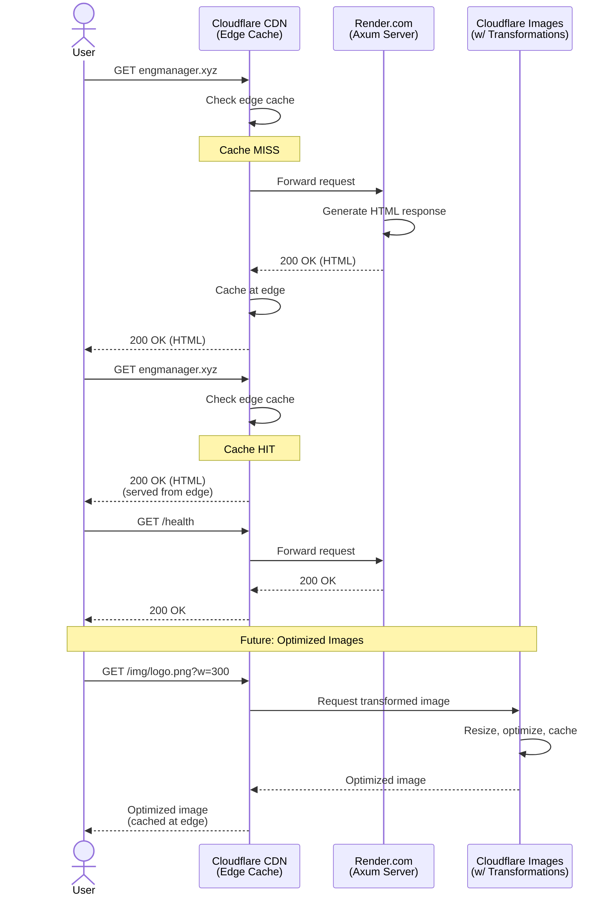

# Architecture

## Internet & Traffic

### Traffic Flow Details

**Current Setup:**
- **Cloudflare CDN** acts as reverse proxy in front of Render.com
- **Homepage caching**: HTML responses cached at Cloudflare edge nodes globally
- **Origin**: Axum server on Render.com serves all dynamic content
- **SSL/TLS**: Full (strict) encryption end-to-end

**Planned Enhancements:**
- **Cloudflare Images**: Host and transform images with automatic optimization
- **Image transformations**: Resize, format conversion, quality optimization on-the-fly
- **Edge caching**: All static assets served from CF edge (sub-10ms globally)
