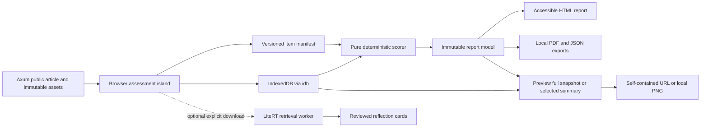

# The Big Six-Seven — client architecture and engineering research

Research date: 19 September 2026. Status: implementation specification, not an implemented application. Target: `https://engmanager.xyz/articles/big-personality`. Application-source inspection was read-only. This workstream also authored the [Snapmatch persistence review](./snapmatch-persistence-review.md). No `AGENTS.md` was found in the engmanager repository or checked parent directories; Snapmatch's own instructions describe that separate project.

## 1. Recommended system

Keep the long-form article in the existing Rust site and mount a deliberately isolated browser application for consent, assessment, scoring, reports, PDF, and sharing. The server serves the same public article, scripts, item banks, and media to everyone. Responses, personal notes, score calculations, report assembly, and export stay in the browser. No account, assessment API, cloud database, analytics payload containing assessment data, or per-user AI endpoint is required.

The baseline should use versioned, deterministic scoring and reviewed prose templates. A scored questionnaire does not need machine learning. The chosen design is IPIP-NEO-120 Big Five plus the 30-item O*NET Mini-IP for RIASEC occupational interests as the sixth **lens**, with the 20-item TwIVI personal-values measure as the seventh lens: 170 scored items if all three modules are completed. The editorial product name is **The Big Six-Seven**; the route remains `/articles/big-personality`. Treat each module as a separate named measure with its own construct, scoring, evidence, and limitations. Core reporting uses raw means; no population percentiles ship in v1. Do not turn unlike measures into a single “personality quality” score. Do not imply that a multi-dimensional interests profile is literally a sixth Big Five factor.

Local-first here means **no remote respondent storage**: no account, Firestore, Firebase Auth, sync outbox, remote draft/report lookup, shortener or personal-data API. First load and optional media/model downloads fetch public assets. The canonical full-state link carries a self-contained snapshot in `#s=`; only the optional selected-domain summary can use an explicitly chosen public query-string share, exposing that summary to infrastructure and recipients. The product must state this distinction in the sharing UI. A URL is not a record identifier resolved by a server.



## 2. Actual repository integration

| Concern | Observed repository behavior | Required integration |
|---|---|---|
| Framework | Rust nightly, Axum 0.8, `eng-markup`/`eng-domain` HTML, `pulldown-cmark` Markdown. No root Node package or React/Astro app. | Preserve this stack. No application rewrite. |
| Articles | `website/src/content.rs` has an explicit `ARTICLE_LIST`; Markdown lives in `website/articles/`. `/articles/{slug}` routes through `website/src/pages/articles.rs`. | Add the article registry entry and Markdown file; compose a personality component or dedicated renderer for this slug. Merely adding a Markdown file does not register a route. |
| Components | `website/src/components/<feature>/{mod.rs,style.css,script.js}`; pure Rust rendering and browser JS behavior. | Add a `big_personality` component; props carry public asset URLs, locale, release ID. Document the JS/data-attribute contract. |
| Build | `website/build.rs` minifies each flat `.js`/`.css` with oxc/lightningcss. It does **not** resolve npm dependencies or bundle imports. Nested component JS files other than `script.js` fail its contract. | Explicitly choose a dependency packaging step; do not assume `import 'idb'` will work. Proposed package strategy below. |
| Assets | Embedded by `rust-embed`; `asset_url` produces short hash names. `strip_asset_hash` can serve current bytes for a previous hash. | Scoring releases require actual version directories and SHA-256 verification. A decorative URL hash alone cannot pin an instrument. |
| Service worker | Existing `/sw.js`, scope `/`, network-first navigation and cache-first `/assets/`. Installation only precaches `/offline.html`. Activation deletes **all** cache names other than `engmanager-v4`. | Extend the existing worker deliberately, namespace ownership, atomically cache a personality release, and normalize this route's navigation cache key. Current behavior cannot support a reliable independently named model/report cache. |
| Shared scripts | Article detail loads Prism from jsDelivr, `experiences.js`, audio, and a soft-navigation router. | Use a reduced assessment shell. Self-host dependencies; omit irrelevant script/telemetry integrations. |
| Privacy blocker | `website/js/src/experiences.js` `sendRum()` sends `href: location.href` to `/__rum`. That includes fragments. | Do not load it on the assessment; prevent retained listeners from previous soft navigation; regression-test request bodies and headers. A fragment alone does not fix this. |
| Navigation | `nav-router.js` fetches and swaps eligible article DOM, retaining loaded scripts/head assets. | Exclude navigation **into and out of** this assessment from interception; force normal navigation across this boundary. Also exclude it from speculation/prerender rules. |
| Headers | Current CSP is report-only and allows broad external scripts/connects. Referrer policy is `strict-origin-when-cross-origin`; middleware overwrites these headers. | Introduce a route policy that the middleware respects; enforce narrow CSP and `no-referrer`. A page-level header silently overwritten by middleware is insufficient. |
| CI | Rust fmt/clippy/tests, including Chromium integration tests, are already configured. | Extend those tests; add JS pure-unit tests and multi-browser assessment tests. Do not replace working Rust checks. |

Relevant inspected files: `Cargo.toml`, `README.md`, `website/build.rs`, `website/src/{content,router,assets,http}.rs`, `website/src/pages/{articles,shell}.rs`, `website/src/components/mod.rs`, `website/js/src/{sw,experiences,nav-router}.js`, `website/tests/common/mod.rs`, `.github/workflows/ci.yml`.

### Dependency packaging decision

For production, add a small **build-only** JS package with a lockfile, exact reviewed dependency versions, and a bundler. Author separate scorer, store, codec, report, and worker modules outside `src/components/`; emit a self-contained classic component entry and separate lazy PDF/ML bundles into declared embedded asset paths. Keep `mod.rs`, `style.css`, and the component `script.js` entry consistent with the current component contract. Prefer one bundling/minification owner per generated output; document any oxc second pass.

Update the production build command and CI together: dependency install from lockfile → bank validation/code generation → browser bundles → `cargo build --release`. Production remains a single Rust binary; Node is needed only during builds. If the project rejects a Node build step, the fallback is checked-in, license-preserving, version-pinned browser bundles with SHA-256 manifests and a reproducible update script. Neither path should import runtime dependencies from a CDN. Review `idb` and PDF dependency licenses and record them in an asset/dependency ledger.

Proposed logical modules (names are design contracts, not existing files):

- `bank`: source items, source IDs, exact wording, keyed direction, scales, release hash and licenses.
- `score`: pure input validation, reverse keying, scale aggregation, coverage, optional approved norms.
- `report-model`: reviewed narrative rules, references, selected work examples and reflection exercises.
- `store`: idb persistence, migrations, conflict handling, export/delete.
- `share-codec`: separately versioned full snapshot and summary codecs, bounded decoding, exact-content preview.
- `pdf`: lazy local generation from the same report model.
- `ui`: native controls, routing state, focus management, save feedback.
- `offline`: public release manifest and cache installation messaging.
- `reflection-worker`: optional, independently versioned LiteRT retrieval experiment.

### Exact repository evidence and P0 blockers

These are release-blocking requirements before any real respondent data is collected, not changes implemented by this research package:

| Priority | Evidence | Release requirement |
|---|---|---|
| P0 | [Full URL in RUM](/Users/matthewharwood/Documents/GitHub/engmanager.xyz/website/js/src/experiences.js:190), [RUM request](/Users/matthewharwood/Documents/GitHub/engmanager.xyz/website/js/src/experiences.js:206), [article inclusion](/Users/matthewharwood/Documents/GitHub/engmanager.xyz/website/src/pages/articles.rs:226) | Assessment excludes this runtime; test that query/fragment payloads and responses never appear in beacons or request bodies. |
| P0 | [Article eligibility in soft router](/Users/matthewharwood/Documents/GitHub/engmanager.xyz/website/js/src/nav-router.js:75), [add-only head synchronization](/Users/matthewharwood/Documents/GitHub/engmanager.xyz/website/js/src/nav-router.js:107), [article router opt-in](/Users/matthewharwood/Documents/GitHub/engmanager.xyz/website/src/pages/articles.rs:257) | Full document navigation into/out of the assessment; no retained RUM or third-party listeners from another article. |
| P0 | [Prism CDN script](/Users/matthewharwood/Documents/GitHub/engmanager.xyz/website/src/pages/articles.rs:205), [report-only CSP](/Users/matthewharwood/Documents/GitHub/engmanager.xyz/website/src/http.rs:191), [overwritten referrer header](/Users/matthewharwood/Documents/GitHub/engmanager.xyz/website/src/http.rs:175) | Reduced self-hosted shell, enforced route CSP and no-referrer headers respected by middleware. |
| P0 for offline | [Deletes unrelated caches](/Users/matthewharwood/Documents/GitHub/engmanager.xyz/website/js/src/sw.js:29), [query-bearing navigation cache](/Users/matthewharwood/Documents/GitHub/engmanager.xyz/website/js/src/sw.js:55) | Namespace cleanup; canonical personality shell cache key; atomic public-asset installation. |
| P0 for version integrity | [Old hash is not verified](/Users/matthewharwood/Documents/GitHub/engmanager.xyz/website/src/assets.rs:139) | Real retained version paths plus full digest verification; never score against silently substituted bank bytes. |
| Build prerequisite | [No dependency bundling](/Users/matthewharwood/Documents/GitHub/engmanager.xyz/website/build.rs:136), [component asset contract](/Users/matthewharwood/Documents/GitHub/engmanager.xyz/website/build.rs:171) | Add explicit locked build packaging or checked-in reproducible browser bundles. |
| Route prerequisite | [Article registry](/Users/matthewharwood/Documents/GitHub/engmanager.xyz/website/src/content.rs:313), [detail renderer](/Users/matthewharwood/Documents/GitHub/engmanager.xyz/website/src/pages/articles.rs:481), [route](/Users/matthewharwood/Documents/GitHub/engmanager.xyz/website/src/router.rs:48) | Register the new article and mount the reduced assessment renderer. |

Line references reflect the inspected checkout on the research date. The first production privacy regression must enter this route from a normal article as well as by direct load; testing only a clean direct visit misses the retained-listener failure.

## 3. Journey and state machine

The server-rendered article remains useful without JavaScript: purpose, constructs, psychometric caveats, research links, local storage/sharing explanation, approximate duration, and what a report can and cannot establish. Starting the assessment is an explicit action. Do not make readers finish the essay before starting.

```text
ARTICLE
  → PRIVACY_AND_INSTRUCTIONS
  → CAPABILITY_CHECK
  → NEW_DRAFT | RESUME_DRAFT | IMPORT_PREVIEW
  → ASSESSMENT(section, item/page)
  ↔ REVIEW_UNANSWERED
  → VALIDATE_AND_FREEZE
  → SCORE
  → REPORT
  → EXPORT_PREVIEW → EXPORT
  → SHARE_PREVIEW → COPY_OR_SHARE

Any writable state → SAVING → SAVED | SAVE_FAILED
Any state → DELETE_PREVIEW → DELETING → ARTICLE
Full snapshot URL → DECODE → SHARED_SNAPSHOT_READ_ONLY | INVALID_SHARE
SHARED_SNAPSHOT_READ_ONLY → CONTINUE_LOCAL_FORK → COMMIT_NEW_DRAFT → ASSESSMENT
Summary URL → DECODE → SHARED_SUMMARY_READ_ONLY | INVALID_SHARE
Ordinary reload → HYDRATE_LOCAL → RESTORE_COMMITTED_CURSOR → ASSESSMENT | REPORT
```

State transitions must not depend on animations, audio, network, or GPU. Keep questionnaire progress and saving state separate: a user may move forward while a write is pending, but must not see “Saved on this device” until the transaction commits. A storage failure exposes memory-only mode and a JSON download; it must never silently discard answers or present a false save badge.

A core domain/facet with insufficient responses is “incomplete,” not a zero. The selected instrument manifest controls completeness rules; experimental add-ons may be skipped without invalidating the validated core. For v1, Big Five reports may privately show complete scales within an otherwise partial assessment. Mini-IP requires all 30 responses before any interest profile is scored; its module-level completeness gate is distinct from the five-item membership of each RIASEC scale. Do not add adaptive shortening in the first release: changing item selection requires a psychometric and scoring design, not just a shorter UI.

Offer a few clearly labeled items per page, a persistent progress count, Back/Continue, a review list, and Resume. Avoid automatic advancing when an answer is selected. Reflect the source instruction frame consistently (typical behavior versus recent behavior). Show tech-specific examples in interpretation, not by silently rewriting validated item wording.

## 4. Data contracts and immutable releases

Illustrative TypeScript interfaces below describe contracts; they do not assume that the current repo compiles TypeScript.

```ts
type ItemId = string;
type MeasureId = string;
type Answer = 1 | 2 | 3 | 4 | 5 | 6; // validate allowed set per instrument
type ResponseValue = Answer | null; // null = unanswered, never neutral

type InstrumentRef = {
  id: string;
  version: string;
  locale: string;
  sha256: string; // full content digest, not existing 8-char asset hash
};

type Instrument = InstrumentRef & {
  sourceCitationIds: string[];
  licenseId: string;
  instructions: string;
  allowedResponses: Answer[]; // IPIP/Mini-IP: 1–5; TwIVI: 1–6
  responseLabels: string[];   // same ordered length as allowedResponses
  responseScoreMap: Partial<Record<Answer, number>>; // one per allowed value
  centering: 'none' | 'module-mean';
  wordingVariantId: string;   // records approved TwIVI pronoun variant
  completionPolicy:
    | {kind: 'complete-scales-only'}
    | {kind: 'withhold-module'; requiredAnsweredCount: number};
  items: Array<{
    id: ItemId;
    sourceItemId: string;
    text: string;
    key: 1 | -1;
    measureId: MeasureId;
    facetId?: string;
  }>;
  measures: Array<{
    id: MeasureId;
    constructClass: 'trait' | 'interest' | 'value' | 'context' | 'experimental';
    aggregation: 'mean' | 'sum' | 'facet-mean';
    itemIds: ItemId[];
    requiredCount: number;
    displayRange: [number, number];
    normsId: string | null;
  }>;
};

type Draft = {
  id: string;                  // random local identifier, never public default
  revision: number;            // compare-and-swap under an IDB transaction
  writerId: string;
  instrumentRefs: InstrumentRef[];
  responseOrder: ItemId[];     // fixed on creation; no mid-draft reshuffle
  responses: Record<ItemId, ResponseValue>;
  skippedItemIds: ItemId[];    // distinct from unanswered; no simultaneous answer
  status: 'draft' | 'complete';
  cursor: {sectionId: string; itemId?: ItemId};
  view: 'instructions' | 'assessment' | 'review' | 'report';
  createdAt: string;
  updatedAt: string;
  consentTextVersion: string;
  optionalModules: string[];
};

type MeasureScore = {
  id: MeasureId;
  nAnswered: number;
  nExpected: number;
  rawSum: number | null;
  rawMean: number | null;
  scalePosition?: number; // optional derived view, not used by v1 core report
  centeredPriority?: number; // TwIVI only: pair mean − complete module mean
  percentile?: {value: number; normsId: string; normsVersion: string};
  incomplete: boolean;
};

type ReportSnapshot = {
  id: string;
  draftId: string;
  inputRevision: number;
  responseDigest: string;
  instrumentRefs: InstrumentRef[];
  scoreEngineVersion: string;
  narrativeVersion: string;
  templateVersion: string;
  locale: string;
  generatedAt: string;
  measures: MeasureScore[];
  narrativeBlockIds: string[];
  caveatIds: string[];
  provenance: 'local-self-report' | 'imported-self-report';
};
```

Keep drafts, item manifests, reports, notes, preferences, and installed asset metadata separate. Raw answers are the recoverable source of truth. Reports are immutable snapshots; changing answers creates a new report, never mutates an exported report under the same ID. Retain source versions needed for old reports. A norm update must create a new interpretation version and explicitly identify the comparison sample. Never silently recalculate a user's historic percentile with a different reference sample.

Public item files contain no respondent information. A release manifest lists full checksums, expected byte sizes, scoring/narrative versions, dependency versions and source/license references. Install and validate a full release before advertising offline readiness. Do not use an app deployment hash as a substitute for the instrument's scientific version.

### Pure scoring boundary

```ts
validateResponses(instruments, responses): ValidationResult
score(instruments, responses, approvedNorms?): ScoreResult
buildReport(scoreResult, templateRelease, selectedContext): ReportModel
renderReportHtml(reportModel): DocumentFragment
renderPdf(reportModel, bundledFonts, staticImages): Promise<Uint8Array>
encodeSummary(reportModel, approvedSelection): string
decodeSummary(encoded, knownSchemas): Result<SharedSummary, ShareError>
encodeSnapshot(frozenDraft, releaseRefs, approvedContent): string
decodeSnapshot(encoded, knownSchemas): Result<SharedSnapshot, ShareError>
```

Use integer sums and counts as canonical scoring values; round only for display. Validate stored responses before applying the instrument-specific `responseScoreMap`. IPIP-NEO-120 uses the identity map `{1:1, 2:2, 3:3, 4:4, 5:5}`; its five-point reverse-keyed items use `6 - response`. Mini-IP stores UI choices as 1–5 but maps them to official scores 0–4: `{1:0, 2:1, 3:2, 4:3, 5:4}`. Its five items per RIASEC scale produce a raw sum from 0 to 20. Do not accidentally report 5–25 sums from storage values. The modules must never share an implicit scoring transformation. Domain aggregation must follow the selected scale's instructions rather than averaging an accidental set of mixed items. For IPIP, each reported facet requires all four responses and each domain all 24; other complete scales may appear in a partial private report. For Mini-IP, set `completionPolicy` to `{kind: 'withhold-module', requiredAnsweredCount: 30}` and withhold the whole interest profile until all 30 items are answered. Five-item scale coverage remains diagnostic metadata, not permission to produce a partial ranked interest profile. Scoring should be independently reproducible using published keys. Do not calculate precision intervals from a guessed reliability coefficient. Do not label a min–max transformation as a percentile. Templates must not infer diagnoses, intelligence, morality, hiring suitability, or an unmeasured construct from a score.

### Seventh-lens contract: TwIVI personal values

TwIVI uses portrait similarity ratings 1–6, with no reverse items. Pair item 1 with 11, 2 with 12, and so on, in order: conformity, tradition, benevolence, universalism, self-direction, stimulation, hedonism, achievement, power, security. Preserve the official response anchors and source wording; store the exact approved pronoun-only display variant. The author explicitly allows any-purpose use and recommends preferred-pronoun branching. [Official TwIVI administration, scoring and permission](https://gosling.psy.utexas.edu/two-short-measures-of-values-tivi-and-twivi/)

Product completeness policy is all 20 responses before either the raw values profile or centered priority profile is reported. `responseScoreMap` is the identity map from 1–6; `centering` is `module-mean`; `completionPolicy` is `{kind: 'withhold-module', requiredAnsweredCount: 20}`. Never impute a skipped item or silently shorten the measure to TIVI. Keep stored responses unchanged.

```text
total = sum(all 20 valid responses)
moduleMean = total / 20
pairSum(value) = response[k] + response[k + 10]
rawMean(value) = pairSum(value) / 2
centeredNumerator(value) = 10 * pairSum(value) - total
centeredPriority(value) = centeredNumerator(value) / 20
```

Keep numerator/denominator or integer source sums until display rounding. Raw means range 1–6. The attainable centered range is −4.5…+4.5: each pair contributes to its own centering mean. Ten unrounded centered scores sum to zero. Equal responses on all items produce a flat, zero-centered profile; they do not establish that the person has no values. A negative centered score means lower endorsement relative to this respondent’s other value ratings. Preserve ties and distinguish this within-person priority from a population percentile, absolute deficiency, moral judgment or strength of a personality trait. Centering preserves a person's rank order and creates dependencies between scores; it cannot create empirical independence from personality or interests.

Display raw mean plus a clearly labeled relative-priority view; do not apply IPIP prose cutoffs or its 0–100 transformation to centered values. Scoring invariants: reject 6 for IPIP/Mini-IP while accepting it for TwIVI; reject 0 for all stored responses; all20=4 gives all raw means4 and centered0; one pair6 with the other18=1 gives that pair+4.5 and the remaining nine−0.5; 19/20 responses withhold the values profile. TwIVI remains excluded from the optional summary `r` codec v1; its responses are supported by the separate complete-state `s` snapshot protocol.

This is a brief personal-values measure, not a direct measurement of preferred employer conditions or proof of tech-specific incremental validity. Values have meaningful but generally modest relationships with Big Five traits, and also show predictable relationships with vocational interests. Report the three lenses separately. [Traits–values meta-analysis](https://journals.sagepub.com/doi/10.1177/1088868314538548), [Sagiv's interests–values study](https://cris.huji.ac.il/en/publications/vocational-interests-and-basic-values/)

Two items per value limit precision; the original study's large derivation/evaluation samples were self-selected online users, not representative tech-worker norms. The manuscript also identifies limited content coverage and occasional low internal consistency. Preserve these limitations in the report; do not infer political or religious identity from the values profile. Workplace examples are editorial applications, not measured outcomes. [Original TwIVI manuscript](https://gosling.psy.utexas.edu/wp-content/uploads/2016/12/Sandy-et-al-JPA-2016-Brief-values-measures.pdf)

## 5. IndexedDB through idb

Use one feature-owned database, e.g. `engmanager.big-personality`, with stores `drafts`, `reports`, `notes`, `preferences`, `instrumentReleases`, and `installedAssets`. Database version tracks storage migrations; instrument, scoring, and prose versions are independent. IDB is browser-origin scoped, so it is not a security boundary between articles on this origin.

`idb` offers promise wrappers, schema upgrades and blocked/blocking callbacks. Crucially, do not await network, crypto, or model work inside an open read/write transaction; the transaction may close. Compute external work first, then persist within a short transaction and await `tx.done`. Handle version changes by closing connections and prompting reload, without deleting the database. [idb official repository](https://github.com/jakearchibald/idb)

Recommended behavior:

1. Update in-memory state immediately; serialize writes and persist each changed response promptly. Save progress in the same transaction as responses/revision. Explicit save status reflects the committed revision.
2. `BroadcastChannel` may announce revision changes, but transactional revision checking is authoritative. If another tab changed a draft, offer to reload or duplicate it instead of last-write-wins data loss.
3. Before scoring, flush writes, validate input, freeze the input revision, compute outside IDB, then atomically store the snapshot only if the revision is still the frozen revision.
4. Migrations are additive where possible and covered by old-database fixtures. If migration fails, retain the original data and expose a recovery export; never “fix” it with `deleteDatabase`.
5. Request persistent storage after the user starts saving or chooses offline availability, not on the article's first paint. Show whether persistence was granted. Check estimated storage before large optional downloads.
6. “Delete my data” closes connections and removes this feature's drafts, notes, reports and selected optional assets, with a separate choice to retain public offline files. Do not delete the blog's unrelated storage.
7. JSON export/import is the portable backup. Import previews versions and contents, validates schema/size, and creates new local IDs; it never overwrites an existing draft automatically.

On ordinary reload, await hydration before creating UI defaults or enabling autosave. Restore the validated active draft's latest committed revision, answers, skipped state, module order, cursor and view. Persist the active-draft pointer in `preferences` with the associated draft mutation. A valid incoming snapshot takes precedence at ingress but does not overwrite or merge with local drafts. Keep the shared view read-only and retain its URL on refresh. “Continue locally” creates a new local ID, commits the fork and pointer, awaits `tx.done`, then removes the share token and enables editing. Decode a valid incoming snapshot even when IDB is unavailable; offer memory-only mode without claiming durable storage.

The [Snapmatch review](./snapmatch-persistence-review.md) provides exact source examples for hydration/schema boundaries. Its local seed writer debounces 150 ms and logs errors, so it is not sufficient evidence that the latest answer survives immediate refresh. The assessment's save indicator must reflect commit completion; action transitions that depend on persistence await it. No browser design can guarantee an uncommitted mutation survives abrupt termination. Save status, prompt writes and recovery export make that boundary explicit.

Browsers ordinarily treat storage as best effort; eviction, explicit clearing, private browsing and device loss remain possible. Persistence requests are not guaranteed, and all storage features need failure handling. Therefore export/restore is a launch feature, not a later enhancement. [MDN storage quotas and eviction](https://developer.mozilla.org/en-US/docs/Web/API/Storage_API/Storage_quotas_and_eviction_criteria), [WHATWG Storage Standard](https://storage.spec.whatwg.org/)

Local storage does not mean encryption at rest. Browser extensions, shared device access, malicious same-origin code, or an origin compromise can expose data. Do not describe an encryption key stored next to data in IDB as protection against those threats. A separately reviewed passphrase-protected file export can be added later; it is not necessary for the initial local-only draft store.

## 6. Offline behavior and service-worker ownership

Use the existing root service worker instead of registering an overlapping worker for a URL without a trailing slash. A path scope is not a strict single-route sandbox, and it does not isolate storage or scripts. Worker scope, script location and `Service-Worker-Allowed` must be deliberately coordinated. [ServiceWorker register documentation](https://developer.mozilla.org/en-US/docs/Web/API/ServiceWorkerContainer/register), [W3C Service Workers specification](https://www.w3.org/TR/service-workers/)

Required root-worker changes:

- Delete only caches owned by the worker/release being retired. Replace the current “delete every cache except current” pattern before introducing a separate personality or model cache.
- Handle exactly `/articles/big-personality` for this app's navigation shell. Use a canonical query-free shell cache key; never create one cache entry for every shared result. The page response must remain identical regardless of encoded report.
- Maintain `bp-shell-<release>`, `bp-assets-<release>` and optional `bp-model-<modelVersion>` namespaces. Cache only public assets. Answers and rendered reports do not belong in HTTP caches.
- Install into a temporary cache; verify every required asset's byte count and digest; mark ready only after success. Delete incomplete installation caches after interruption. Keep a recoverable prior release until active clients/drafts can use the new one.
- Offer an update when a draft is safe. Do not silently force a new scoring or item release mid-session using `skipWaiting()` plus `clients.claim()`.
- Handle route entry with query strings offline by serving the same cached shell. The client can then decode the supplied summary. Unknown versions show a clear message rather than guessed scores.
- Core assessment, charts, prose and PDF fonts must be cached for a truthful “ready offline” indicator. Optional audio/images/models have their own installed-state indicators.
- First-ever offline visit is unsupported. The promise is “works offline after this version finishes downloading,” and this must be tested with a completely disconnected network.

The current asset handler's old-hash fallback is specifically unsuitable for immutable instrument pinning. Put instrument releases under persistent literal version directories such as `/assets/big-personality/instruments/ipip-neo-120/en/v1/items.json`, keep previous supported releases, and verify digest before scoring. Reject missing/mismatched releases; never substitute latest content for a historic version.

## 7. Sharing: query parameters, privacy, and social previews

Two separately versioned protocols serve different purposes: full state `s` reconstructs the questionnaire/report; optional summary `r` shares only selected complete Big Five domains. Never label an `r` link a complete backup or an exact questionnaire replay. Provide explicit choices plus downloads:

| Mode | Example | Promise and limitation |
|---|---|---|
| Full snapshot, canonical transport | `/articles/big-personality#s=<payload>` | Self-contained answers, progress and report versions. Opening/refreshing recreates the fixed snapshot read-only; existing local drafts remain intact. Anyone with the link can decode its content. |
| Optional public query summary | `/articles/big-personality?r=<payload>` | Selected complete Big Five domain means, intentionally public. This compact social option does not reproduce questionnaire state or a complete report. |
| Optional fragment summary | `/articles/big-personality#r=<payload>` | Same summary without including the fragment in the HTTP request. Page scripts and the platform where it is pasted can still access the full link. |
| Download | Local PNG, PDF, JSON | User chooses the receiving app/file recipient. No upload by this app. |

Fragments are interpreted by the client and excluded from the HTTP request. They are not encryption or access control. [MDN URI fragment](https://developer.mozilla.org/en-US/docs/Web/URI/Reference/Fragment), [RFC 3986 §3.5](https://www.rfc-editor.org/rfc/rfc3986#section-3.5)

### 7.1 Optional selected-domain summary (`r`)

V1 **summary** shares contain only selected, complete Big Five domains and instrument/scoring identifiers. They do not include facets, interests, values, incomplete-scale flags, or coverage counts. A private report may be partial, but an incomplete domain cannot be selected for a summary share. Omitted domains mean “not shared,” never “zero” or “incomplete.” Exclude raw item answers, exact timestamps, age, gender, email, name, employer, role history, local draft IDs and notes. Show the precise public preview before copying; update the preview immediately when selection changes. Interests/facets summary sharing would require a separately reviewed later `r` schema. The full snapshot protocol below intentionally has different content.

Proposed v1 codec is intentionally small and boring:

```text
r = "1." + base64url(UTF8(canonical JSON))

{
  "s": 1,                         // sharing schema
  "i": "approved-instrument-id",  // allowlisted, immutable
  "iv": "1",                     // instrument version
  "sv": "1",                     // score semantics version
  "lang": "en",
  "m": [["O", 392], ["C", 344]], // approved IDs, raw mean × 100
  "kind": "raw-mean-centi"       // values 100–500; never percentile
}
```

V1 permits only Big Five domain IDs `O`, `C`, `E`, `A`, and `N`, serialized in that canonical order when selected. Before serialization, require that every selected domain is complete in the private report; reject attempts to share incomplete scales. On decoding, validate only the explicitly supplied summaries, which remain unverified self-report: the URL does not contain raw responses to prove completion. Additional interest/value dimensions require distinct IDs and their own range semantics in a later schema, not aliases to Big Five scores. V1 excludes them. Shared core values are rounded raw means (3.92 in the example), so exact internal sums remain in the private report/backup, not the link. No compression is necessary for this summary. Enforce an engineering cap of 1,500 URL characters; this is a product compatibility budget, not a universal browser limit. If the selection does not fit, reduce it or export a file.

Decoder contract: reject repeated `r` parameters; reject ambiguous simultaneous query and fragment payloads or simultaneous `r` and `s`; bound encoded and decoded sizes before parsing; validate UTF-8 and the exact schema; reject unknown keys/versions/measure IDs, duplicates, nonfinite/out-of-range scores and excessive dimensions; construct fresh typed data without object merging; render only through `textContent`/safe DOM nodes. No remote URLs, HTML, Markdown, CSS, scripts, function names or template source may appear in the payload. No decompression in v1 means no decompression-bomb surface. Test Unicode, truncated base64, hostile object keys and very long links.

### 7.2 Complete state snapshot (`s`) — normative v1 contract

This contract is separate from any small synthetic design-preview codec. Production `s` carries all selected questionnaire state and enough immutable release identity to rebuild its deterministic report without a respondent lookup. The app may retrieve only public versioned release assets; it never sends the snapshot to resolve it.

```text
s = "1." + unpaddedBase64url(UTF8(canonicalJSON(snapshot)))
```

Canonical JSON has the exact key order below, no insignificant whitespace, integers in decimal, ordinary JSON string escaping and no unknown keys. A decoder rejects duplicate JSON keys (use a duplicate-aware parser), noncanonical bytes and invalid UTF-8; after schema validation, re-encoding must equal the input exactly. It must not rely solely on `JSON.parse`, which does not report duplicate keys. No compression, encryption, signing or embedded executable content is used in v1. Full snapshots are fragment-only in v1: reject `?s=` rather than generating or accepting raw-answer query transport.

```ts
type ReleaseRef = [version: string, sha256LowercaseHex: string];
type SnapshotV1 = {
  v: 1;
  releases: {
    instruments: [
      [id: 'ipip-neo-120', version: string, sha256: string],
      [id: 'onet-mini-ip-30', version: string, sha256: string],
      [id: 'twivi-20', version: string, sha256: string]
    ];
    content: ReleaseRef;   // reviewed narrative rules/cards/source wording variants
    scoring: ReleaseRef;   // algorithm/keys/completeness semantics
    template: ReleaseRef;  // report structure and exact reviewed prose composition
    order: ReleaseRef;     // canonical 170-slot item-ID mapping
  };
  locale: 'en';
  modules: Array<'big5' | 'interests' | 'values'>; // unique, selected display order
  wording: 'they' | 'he' | 'she';                 // approved TwIVI variant
  responses: string; // 64 response bytes encoded as unpadded base64url
  answered: string;  // 22 bytes, one bit per canonical item, base64url
  skipped: string;   // 22 bytes, one bit per canonical item, base64url
  cursor: null | {module: 'big5' | 'interests' | 'values'; slot: number};
  view: 'instructions' | 'assessment' | 'review' | 'report';
  reportDate: null | string; // Gregorian YYYY-MM-DD display date, not a local timestamp
  blocks: string[];         // sorted unique approved reflection-card IDs, up to 12
};
```

The release IDs above are protocol aliases, not permission to rename the licensed source items. The immutable release registry binds each alias/version/digest to the approved bank and source IDs. Every SHA-256 is exactly 64 lowercase hexadecimal characters. Version and block IDs are bounded ASCII strings of 1–64 characters matching `[A-Za-z0-9._-]+`. All references must resolve to a mutually compatible allowlisted release set; reject missing/mismatched assets instead of substituting a newer release. The order release must map exactly 170 slots: IPIP source items 1–120 at indices 0–119; Mini-IP source items 1–30 at 120–149; TwIVI items 1–20 at 150–169. Item IDs are resolved through this frozen order manifest; the URL does not repeat 170 item-ID strings. All three instrument references remain present even when optional modules are unselected. V1 does not randomize item order; changing order semantics requires another order release and decoder support.

`modules` contains `big5` exactly once and zero or one of each optional module; it has 1–3 entries and determines the navigation/module presentation order. Within each module use its canonical source order. The answer packing order remains the fixed 170-slot order regardless of navigation order. `cursor.slot` is an integer 0–169, belongs to its declared selected module and is retained even when viewing a report so a local fork can resume correctly. `cursor` may be null only in `instructions`; all other views require it. A report view may be partial and must use the instrument completeness policies. `reportDate` is null until a dated report is frozen; if displayed, it is copied verbatim from the snapshot rather than generated using the receiver's clock. `blocks` identifies optional reviewed reflection text, not arbitrary text or model prompts. Trait/interest/value narrative selection is deterministic under the pinned rules.

Packing is **most-significant bit first**. For slot `i`, its response occupies stream bits `3i`, `3i+1`, `3i+2`, highest value bit first; stream bit `j` is bit `7-(j mod 8)` of byte `floor(j/8)`. A decoded three-bit value `0` becomes `null`; `1…5` are allowed for core and interests; `1…6` for values; `7` is always invalid. The last two unused bits of the 64th response byte must be zero. Do not transform Mini-IP responses into scored 0–4 values in this protocol: zero is reserved for unanswered and scoring happens later.

For each status bitset, slot `i` is bit `7-(i mod 8)` of byte `floor(i/8)`; the final six unused bits must be zero. `answered[i]` must equal `responses[i] !== 0`. `skipped[i]` may be 1 only when the response is 0. Both false means an unanswered item that has not been explicitly skipped. Every unselected optional-module slot must have response 0 and both bits 0; generating a snapshot that excludes a previously answered module must clear that module in the export copy and disclose the omission, without deleting the local answers. Modules included in a complete-state replay retain all their answers. The response string is exactly 86 base64url characters; each status bitset is exactly 30, with zero unused base64 tail bits as well as zero packed padding bits.

Notes are excluded from the v1 link schema, along with name, employer, email, browser identity, local draft ID, writer ID, revision timestamps and analytics identifiers. Reject these as unknown fields, even if their values appear harmless. The preview discloses that private notes are omitted; the exact-link equivalence contract covers the selected assessment/report, not omitted notes. Separately selected notes may be included in a local personal JSON/PDF export. Any later notes-bearing URL protocol needs a new reviewed schema and explicit content preview.

Cap the whole `s` token at 8,192 ASCII characters and the decoded JSON at 6,144 bytes before parsing; require the standard fixture set to fit within 4,096 token characters. These are engineering budgets, not universal browser/platform guarantees. Test the intended social targets; offer JSON/PDF download if a platform truncates or rejects a link. No server-side shortener is allowed. The decoder rejects a second `s`, any query `s`, simultaneous `s` and `r`, both query and fragment payloads, noncanonical base64url, invalid lengths/padding, contradictions between answers and flags, invalid module/cursor combinations, unknown keys/releases and out-of-range values. Reject the entire payload rather than partially importing it.

Ingress precedence is **valid URL snapshot → existing local state → fresh defaults**. The URL snapshot opens read-only in memory without mutating the existing local draft or preferences. Keep `#s` in the address bar so refreshing reconstructs the same snapshot independently of newer local work. Invalid/unsupported URL input yields an error, not silent fallback to a different report. An explicit “Resume my local assessment” action may remove the payload and hydrate local state.

“Continue locally” forks the decoded snapshot into a fresh local draft, validates and commits it together with its new active pointer, then removes `s` and enables writes. It retains the previous local draft. Do not remove `s` before a successful commit: otherwise an immediate refresh could lose the imported state. Changing a read-only shared view's answers is forbidden until that fork action. Public release-cache installation is allowed during decoding but does not persist respondent state implicitly.

Exactness means identical normalized response and navigation state, deterministic scores, report section ordering and reviewed prose under the same releases. Locale, wording variant, module order, optional card selection and displayed report date are therefore captured. Responsive layout, system font rendering, expanded/collapsed presentation controls, scroll position and PDF binary metadata are outside this semantic contract. If a report uses optional model assistance, serialize the resulting allowlisted card IDs; do not rerun nondeterministic inference to reconstruct prose. Raw responses and pinned scoring versions, not derived rounded scores, are authoritative. A PDF may have identical report content without byte-identical output across PDF engines.

### 7.3 Shared privacy and preview behavior

A checksum can detect accidents but cannot prove authenticity. A signing secret shipped in browser JavaScript is not secret. Shared reports must say “self-reported, shared by its creator”; they are not verified credentials. Fully self-contained links cannot reliably expire or be revoked. Deleting local data cannot delete copies someone has received.

Set route `Referrer-Policy: no-referrer` and suppress full-URL telemetry. Preserve the canonical full `#s` payload to meet refresh replay; never strip it merely after rendering. A public summary query `?r` may be converted to the identical `#r` token after decoding. Do not claim this undoes the initial query request or a social platform's copy. The user can explicitly leave the shared view or fork locally to remove it. [W3C Referrer Policy](https://www.w3.org/TR/referrer-policy/)

Do not promise personalized Open Graph cards from local data. Serve one static public article card/canonical URL. Most preview systems use the HTTP response, and a fragment is absent there. Per-person OG rendering would require server-visible data and platform-specific handling. Generate a PNG share card locally from the reviewed score model; let the user download or share that file alongside the link. Feature-detect `navigator.share`/`navigator.canShare`, invoke on a click, and retain Copy link/Download as fallbacks. [MDN Web Share](https://developer.mozilla.org/en-US/docs/Web/API/Navigator/share)

## 8. Report rendering and local PDF

Use a single structured `ReportModel` as the source for HTML, PDF and PNG, not screenshot scraping of the live interface. Recommended report sections: scope and provenance; core score overview; domain/facet details and coverage; distinct optional modules; how tendencies may show up in tech work; tensions and environment fit; three user-chosen experiments; methodology and sources; privacy/export information. Names and personal notes are optional and excluded from public artifacts by default.

The HTML report is the primary accessible output, with visible text values and tables accompanying charts. Keep a distinct personal-values section with raw similarity means and within-person centered priorities. Prefer horizontal dot/band plots to a lone radar polygon: they allow direct comparison without area and ordering effects. If radar is added as a decorative summary, retain the complete labeled table and explicit range.

For a one-click local PDF, evaluate a pinned `pdf-lib` release with embedded licensed fonts and deterministic layout primitives. It runs in browsers and can create PDFs, embed images and draw text/vector graphics. Lazy-load it when the user requests download; cache it during optional offline preparation. [pdf-lib official documentation](https://pdf-lib.js.org/), [pdf-lib repository](https://github.com/Hopding/pdf-lib)

PDF design requirements are project requirements, not claims about automatic library features: selectable text; vector charts; explicit wrapping/pagination; repeated headers where appropriate; source/version footer; no hidden personal data in metadata; cover name only if requested; both Letter and A4 page templates; bounded image resolution; font glyph checks. PDF tagging/PDF-UA compliance is a separate validation task and must not be claimed merely because text is selectable. Keep accessible HTML available even if the initial PDF is untagged.

Deterministic report content does not automatically imply identical PDF bytes. Freeze report timestamps, metadata, asset versions, layout order and rounding; validate content equivalence and layout. Require byte-for-byte stability only if the chosen library can deliver it and the contract needs it.

Also ship a print stylesheet and “Print / Save as PDF” fallback. `window.print()` invokes the browser dialog, so it is not itself an automatic downloaded PDF. Remove navigation, audio controls and action buttons from print; keep source URLs and caveats. [MDN print](https://developer.mozilla.org/en-US/docs/Web/API/Window/print)

Generate art and ElevenLabs sounds at authoring/build time from generic concepts, then host static licensed files. Runtime personalization should choose or compose approved assets locally. Do not send a respondent's answers to an image/TTS service. Avoid client API keys. Audio is off initially, requires a deliberate action, has a persistent mute, and never provides essential information alone.

## 9. LiteRT: a viable optional experiment, not the scoring engine

As verified on the research date, Google documents **LiteRT.js**, package `@litertjs/core`, for browser inference using `.tflite` models. The official repository describes WebGPU and CPU/WASM execution, incomplete operation coverage and runtime memory limits. It supplies inference, not the complete tokenizer/preprocessing/postprocessing or a validated personality model. [Google LiteRT.js repository](https://github.com/google-ai-edge/LiteRT/blob/main/litert/js/README.md)

The documented initialization is `loadLiteRt(wasmPath)` followed by `loadAndCompile(modelPath, {accelerator: 'webgpu'})`; a WASM CPU configuration is also documented. WebNN is described as experimental and requiring special configuration, so it should not be a public product dependency. Run an operator/shape compatibility spike with the actual selected model and Google's model tester, then test real devices. [Google LiteRT.js getting started](https://developers.google.com/edge/litert/web/get_started)

Do not conflate this runtime with LiteRT-LM or MediaPipe LLM pipelines, and do not assume an arbitrary chat model will load. A runtime proves execution capability, not scientific or narrative validity. WebGPU availability varies by browser/device and needs feature detection plus real testing; an absent GPU must not prevent the report. [Google LiteRT web overview](https://developers.google.com/edge/litert/web), [MDN WebGPU](https://developer.mozilla.org/en-US/docs/Web/API/WebGPU_API)

**Best bounded use case:** optional local semantic retrieval over a curated library of reflection exercises. A user writes “I avoid design reviews because criticism throws me off”; a small text-embedding or classification model can rank reviewed exercises. The browser still selects only approved text and links, displays why the exercise was selected, and allows the user to override it. It does not infer traits from text, modify questionnaire scores, invent interpretations, or rank career worth.

Baseline comparator: tag/keyword search plus user-selected goals. Adopt LiteRT only if a predeclared evaluation shows meaningful improvement in finding relevant exercises. A technically impressive model that offers no measured benefit should be removed.

Experiment interface and release gates:

```ts
type ReflectionRequest = {query: string; allowedCardIds: string[]};
type ReflectionResult = {ranked: Array<{cardId: string; relevance: number}>};
// Relevance is a retrieval score, not psychological confidence.
```

- Offer explicit download with exact model/runtime bytes, expected storage and a cancel button. Do not automatically fetch large weights on mobile or startup.
- Self-host pinned model, tokenizer, vocabulary, WASM and license files. Store large public assets in feature-owned Cache Storage, with installed metadata in IDB; verify digests. Do not inline weights into the app bundle.
- Run in a dedicated worker if the tested backend supports it. Terminate on cancellation, enforce resource/time budgets, dispose tensors/models, handle GPU device loss and clear optional assets independently.
- Use an English-only model initially if that is the tested language. Do not silently apply it to unsupported languages.
- Require a proposed maximum total optional download of **30 MiB for the model, runtime, tokenizer/vocabulary and required support files together**, and p95 warm retrieval under **500 ms** on a named midrange reference device. These are go/no-go engineering targets, not observed performance. Publish measured results before enabling it.
- Evaluate on independently authored goal queries, with blinded relevance judgments and problematic/ambiguous inputs. Check no unsafe card IDs or invented text escape the allowlist.
- Every failure returns to the deterministic selector. No network inference fallback.
- Add only the CSP capability needed by the selected WASM build. Do not globally enable `unsafe-eval` or cross-origin isolation without testing existing site behavior. Multithreaded WASM may require additional headers; choose a supported simpler build if these headers conflict with the blog.

On-device generation of report art, sounds, or long personalized prose is unnecessary for v1 and would substantially increase download, battery and QA requirements. Use static authored media and transparent rule-based prose first.

## 10. Privacy, security and accessibility gates

The reduced assessment page must contain only reviewed first-party scripts and assets. Route-level CSP should be enforced, not merely report-only; start from `default-src 'self'; object-src 'none'; base-uri 'none'; frame-ancestors 'none'; form-action 'none'; connect-src 'self'; worker-src 'self'`, then enumerate the necessary script/style/font/image/media policies. Remove inline runtime code or give fixed scripts appropriate hashes; keep WASM exceptions confined to the optional feature. The exact policy must be tested against the rendered shell. [W3C CSP Level 3](https://www.w3.org/TR/CSP3/), [MDN script-src](https://developer.mozilla.org/en-US/docs/Web/HTTP/Reference/Headers/Content-Security-Policy/script-src)

An enforced CSP reduces risk but is not a storage boundary: `connect-src 'self'` still permits same-origin exfiltration by compromised allowed code, and other articles share IDB origin access. Inventory and audit same-origin scripts, avoid unnecessary third-party scripts across the site, and describe this threat model accurately. A separately hosted app origin could provide stronger isolation, but it is a later architectural alternative and changes the same-path hosting requirement.

For this feature, disable analytics, full-URL error collection, session replay, input tracking, RUM and automatic read-aloud. Never collect optional free text through logs or error stacks. Check that shared “Share article” controls use the feature's preview flow instead of blindly forwarding `location.href`. Store development fixtures that are synthetic, not the user's supplied report or real answers. Encryption primitives in Web Crypto can support a separately designed export feature, but they do not solve key management automatically. [MDN Web Crypto](https://developer.mozilla.org/en-US/docs/Web/API/Web_Crypto_API)

Accessibility target: WCAG 2.2 AA, verified with automated checks **and** manual keyboard/screen-reader tests. Native radio buttons within `fieldset`/`legend` are the default for each item; label all response anchors, not just numbers. Maintain a visible focus indicator, logical headings and an announced section change. Avoid a 100-row grid that requires horizontal scrolling. No timers, speed scoring, drag-only controls or hidden keyboard shortcuts. No reliance on hue, hover, animation or sound. Respect reduced motion and text zoom; ensure controls remain usable at 320 CSS px and 200% zoom. [WCAG 2.2](https://www.w3.org/TR/WCAG22/), [WAI grouping controls](https://www.w3.org/WAI/tutorials/forms/grouping/)

Show unanswered-item errors as an accessible summary linking to affected items. Do not steal focus with a save toast. Use polite status text for saves and downloads. A user must be able to read, complete, revise, export, and delete using only the keyboard and a screen reader. Test mobile radio target spacing; 44 px targets are a useful product goal, while conformance depends on the relevant WCAG criterion and exceptions.

## 11. Verification and release plan

These gates concern an assessment's actual failure modes, not tests that merely duplicate implementation.

| Gate | Required evidence |
|---|---|
| Instrument provenance | Every item has a source ID, license, exact wording, key and measure mapping; manifests reject duplicate/missing IDs; independent hand-scored fixtures agree with engine results. |
| Scientific claims | Reviewed wording separates validated core, experimental/context modules, scale positions and true norm percentiles; no invented population ranks or diagnostics. |
| Scoring | Test minimum/maximum/neutral, mixed reverse keys, invalid answers, missingness thresholds, order-independent scoring, domain/facet aggregation, and published worked/reference examples where available. Explicitly verify Mini-IP storage values 1 and 5 map to scores 0 and 4, yielding RIASEC sums 0 and 20; 29/30 responses withhold the whole interests profile. Test that incomplete Big Five domains cannot be selected for v1 summary sharing. Validate TwIVI six-point input, all ten pair sums, respondent centering, zero-sum/flat/extreme fixtures, and all-20 completeness. |
| State/persistence | Reload after each page restores committed cursor before editable defaults; forced transaction error/quota failure, migration from old fixtures, abrupt tab close, multiple-tab conflict, interrupted export and recovery import. Never claim “saved” before commit. Existing local A plus incoming snapshot B renders B on repeated refresh without changing A; a committed fork creates C and preserves A. |
| Versioning | Draft from release A survives deployment B; missing A assets refuse unsafe substitution; report snapshots preserve original inputs and prose versions. |
| Offline | Clean online install → full disconnect → reload route → resume → complete → score → render → PDF. Query and fragment shared views also work when required release is installed. First-visit offline shows an honest fallback. |
| Network privacy | Instrument browser requests, headers, bodies, beacon/fetch/websocket and navigation logs through completion/export. No responses/notes/full reports leave automatically; only an intentionally selected `r` public query exposes summary fields to the host. Fragment payload never appears in RUM; no Firestore, auth, personal-data API or shortener exists. |
| Sharing | Full partial/complete snapshots round-trip into a fresh browser profile with no lookup; source answers and recomputed report text agree. Test all 170 slots, module-specific bounds, 6 only in TwIVI, 7 rejected, padding bits, answered/skipped contradictions, cursor validation, query `s` rejection, dual `r`/`s`, duplicate JSON/query keys, unknown releases, oversized structures and social truncation. Summary preview equals its smaller field set; no authenticity or revocation claims. |
| PDF | Text extraction agrees with HTML; render every page and inspect clipping, page breaks, chart labels, fonts, contrast and Letter/A4; include long names/notes and incomplete/optional-module states. |
| Accessibility | Keyboard, VoiceOver/Safari and NVDA/Firefox or Chrome; radio semantics, focus/errors, reduced motion, 200% zoom, small viewport, high contrast; HTML remains the accessible equivalent. |
| Performance | Establish named desktop and midrange mobile fixtures. Proposed core budget: <=150 KiB gzip-compressed JS excluding lazy PDF/model/media, input response <100 ms, scoring <50 ms for the complete bank. Report measured numbers. |
| Media | Audio off initially; user-controlled and optional; no score-dependent celebratory/shaming sounds; images have appropriate alt text or empty alt; all media provenance recorded. |
| Browser coverage | Current and previous stable Chrome/Edge/Firefox, Safari/macOS and Safari/iOS, plus private mode and disabled storage. Optional features fail independently. |
| Existing site | Rust fmt/clippy/tests pass; assessment boundaries do not break navigation, root SW caching or other subdomain flows; root cache cleanup never deletes unrelated caches. |

Suggested sequence:

1. **Scientific freeze:** select measures and permissions, item bank, keys, missingness, norms policy, interpretation and citations. Resolve claim wording before UI implementation.
2. **Vertical slice:** article → 10 synthetic items → IDB resume → deterministic score → accessible HTML → JSON export; establish reduced shell and network privacy tests.
3. **Full assessment:** complete bank, facet/core aggregation, optional modules, reviewed report prose and printable design.
4. **Reliable delivery:** one-click PDF, offline release installation, version recovery, bounded sharing, social PNG and asset provenance.
5. **Validation/pilot:** psychometric study and UX/accessibility/device testing; publish evidence limits. Do not infer validation from software test pass rates.
6. **Optional LiteRT study:** retrieval prototype compared with deterministic baseline, download/performance/license gates, then explicit opt-in only if it helps.

Engineering definition of done: a user can understand the purpose, complete the approved instrument, resume the committed cursor after reload, obtain the correctly versioned report, export, reconstruct an exact selected snapshot from a self-contained fragment, optionally share a selected-domain summary, and remove local data. No respondent storage service exists; no assessment content leaves automatically. Only an explicitly public query summary is server-visible by design. Scientific validation is an additional research program, not something this architecture can manufacture.
