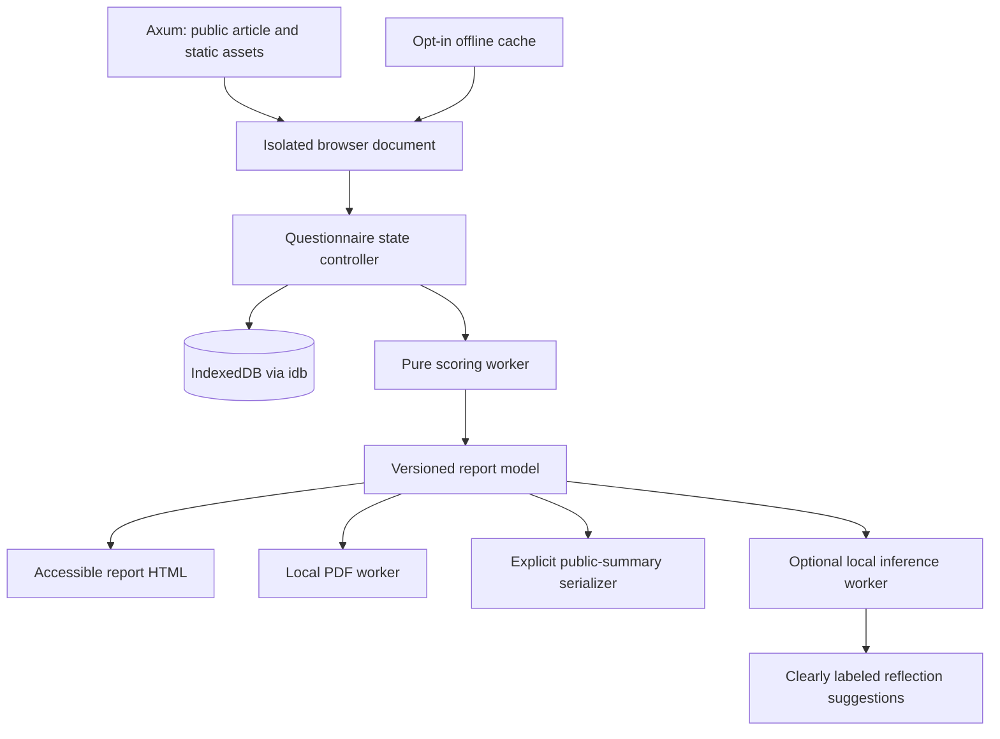

# The Big Six-Seven

## Engineering requirements and research decisions

**Version:** 0.3, research and implementation specification · **Date:** 19 September 2026
**Destination:** `https://engmanager.xyz/articles/big-personality`
**Audience:** Early-career engineers, product managers, designers, and other people working in tech.
**Delivery status:** Research package, frozen question banks, editorial draft, interactive design preview, and generated media. This document specifies the production application; it is not a claim that the assessment has been implemented or validated in this community.

## 1. The decision

Build a private, self-guided reflection experience with **170 items across three established measures**: 120 public-domain IPIP-NEO items, the 30-item O*NET Mini Interest Profiler, and the 20-item Twenty-Item Values Inventory (TwIVI). Interpret five personality domains and 30 facets, then add a sixth lens, **work interests**, and a seventh, **personal values**. All three modules are offered in the full experience; people may skip modules without losing access to completed results.

Use the exact product name **The Big Six-Seven**, a deliberate joke on the [6-7 meme](https://en.wikipedia.org/wiki/6-7), with the persistent subtitle **“Big Five personality + work interests + personal values.”** The name does not claim newly discovered sixth and seventh personality factors. Work interests contain six RIASEC dimensions; personal values contain ten value priorities. Each is a separate profile, not one scalar added to a seven-axis personality chart. Keep the humor in the name and optional introductory copy; questions, scoring, sources and uncertainty remain sober and legible.

The useful distinction is between **how I tend to behave**, **which activities attract me**, and **what I consider worth pursuing**. These constructs have relationships; distinct does not mean uncorrelated. Research supports the additional information in vocational interests beyond personality, but does not establish the validity of this product's tech-specific advice. See [sixth-dimension research](sixth-dimension-research.md).

Generate scores and the primary report with deterministic, inspectable code. Add optional on-device machine learning only if a measured usability benefit justifies the download and complexity. Generate artwork and sounds once during production, then ship static files. No account, inference API, or submission endpoint is necessary for a visitor to finish.

## 2. What to take from the supplied report

The supplied `big5.pdf` is a 38-page Understand Myself report based on the Big Five Aspects Scale. Its structure moves from an overview to trait and aspect chapters, with percentile graphics and substantial interpretation. That structure is a useful reference. Its five domains and ten aspects are a different hierarchy from the recommended IPIP-NEO's five domains and 30 facets. They cannot be relabeled or converted into each other.

Retain the clear chapter rhythm, visible scale explanations, and discussion of contextual advantages and difficulties. Replace long categorical descriptions with shorter, conditional interpretations and practical experiments. Do not reproduce the supplied personal scores, publisher prose, photographs, or percentile norms in the public product. Do not infer political identity, intelligence, diagnosis, career suitability, or a person's worth from the results. No generalization about a group establishes an individual reader's ability.

BFAS-100 is a reasonable alternative if matching the ten-aspect structure is the priority. The IPIP-NEO-120 is selected for its public item/key provenance and finer-grained facet coverage, with the trade-off that four-item facet scales need cautious interpretation. [DeYoung, Quilty & Peterson, 2007](https://www.cs.uky.edu/~sgware/reading/papers/deyoung2007between.pdf); [core instrument research](psychometrics-research.md).

## 3. Scope and evidence boundaries

### Included in the first release

- Long-form introduction readable without JavaScript.
- A 120-item personality questionnaire, resumable locally; a separate optional 30-item interests module.
- A distinct 20-item personal-values module, scored from its own dedicated answers using TwIVI; no inference of values from personality or interest scores.
- Domain and facet scores, a work-interest profile, report explanations, and editable personal reflections.
- A local report library, export/import backup, explicit deletion, and offline use after installation completes.
- A text-based PDF download, a small selected-score summary link, an exact-state snapshot link, and a downloaded share image.
- Keyboard and screen-reader access; responsive layout; sound disabled initially.

### Excluded from the first release

Employer dashboards, candidate ranking, diagnostic interpretations, compatibility scores, automatic career assignment, population percentiles without appropriate norms, an overall personality score, adaptive item selection, AI-generated assessment items, and automated uploads of research data.

Validity applies to a score interpretation for an intended use. Evidence for an established questionnaire does not automatically transfer to rewritten items, a new occupational population, a translated interface, or generated career advice. We label each report block as **instrument description**, **your responses**, **editorial reflection**, or **optional AI suggestion**. This boundary follows the intended-use approach in the [Standards for Educational and Psychological Testing](https://www.testingstandards.net/uploads/7/6/6/4/76643089/9780935302356.pdf).

## 4. Instrument and question requirements

The authoritative implementation inputs are [question-bank.json](question-bank.json) and [extension-question-bank.json](extension-question-bank.json). Their readable counterparts are intended for editorial review. Every item requires a stable ID, exact wording, instrument/version, response scale, construct, source, and key direction. Preserve source provenance and all extension license notices.

| Module | Content | Output | Status |
|---|---|---|---|
| Personality | 120 IPIP-NEO items; 24 per domain; four per facet | Five domains, 30 facets | Established measure; this deployment still needs evaluation |
| Interests | 30 O*NET Mini-IP activity items; five per RIASEC scale | Six activity-interest scores | Established measure; preserve its terms and response format |
| Personal values | 20 TwIVI portrait items; two per value | Ten raw value means and centered within-person priorities | Established brief measure; two-item scales limit precision |

Use the source response anchors for each module. The personality module asks how accurately statements describe the person; the interests module asks how much they would like activities. Do not carry an “accuracy” legend into the interests module. Give a transition screen and an example that is not scored.

For O*NET, use the complete unmodified-tool distribution path under CC BY-ND 4.0 and retain its attribution, instructions, labels, scoring and career-exploration purpose. The O*NET Tools Developer License provides a separate path for adaptations; its section 3(b) distinguishes software-only integration from content/purpose modifications that require validation before release. Keep our tech examples and the TwIVI module visibly outside the O*NET instrument. Verify the final integration against the [official license options](https://www.onetcenter.org/license_tools.html) and [Developer License](https://www.onetcenter.org/license_toolsdev.html).

TwIVI uses a separate six-point **portrait-similarity** response scale: 1 means “Not like me at all” and 6 means “very much like me.” Preserve all six source labels, the source portraits and pair mapping. The author explicitly permits any-purpose use; retain citation and provenance rather than calling it public domain. Its original study used separate derivation and evaluation samples (38,049 and 29,143); two-item scales still need cautious individual interpretation. Our seventh lens measures general personal values, not a validated workplace-only preference scale. [Author instrument, instructions and permission](https://gosling.psy.utexas.edu/two-short-measures-of-values-tivi-and-twivi/); [Sandy et al., online 2016 / journal 2017](https://doi.org/10.1080/00223891.2016.1231115).

Preserve the frozen administration order. Do not cluster the Big Five items by trait, show live personality scores, praise particular answers, or silently “modernize” phrases. Tech-specific examples belong in interpretation after scoring. Some source items refer to politics or negative affect: disclose this before starting and allow skipping. A skipped answer is `null`, never a midpoint. An answer may be changed before report finalization.

Time estimates begin as hypotheses: approximately 25–35 minutes for the full 170-item battery, plus optional reflection. Replace this estimate after a consented usability pilot; do not manufacture completion-time data. Show items completed, not a countdown. Allow pauses without penalties.

## 5. Scoring contract

For the personality scale, each response is an integer `x` from 1 to 5. Positive items score `x`; reverse-keyed items score `6 - x`. Retain original responses separately from keyed scores. A complete facet has four keyed items. A complete domain has 24. Compute unrounded sums and means; round only at display time.

The primary display is a keyed **mean from 1.00 to 5.00**. An optional 0–100 visualization uses `25 × (mean - 1)` and is labeled **“position on the response scale, not a percentile.”** It is not “percent personality,” percentage correct, or standing among engineers. No cross-domain winner is meaningful merely because two domains have different means.

**Missingness policy for v1:** require all four items for a facet score and all 24 for a domain score. Return unavailable for incomplete scales; complete personality scales can still be shown in a partial report. Show the specific missing item count and a way to resume. Do not impute, reuse earlier answers, or drop reverse items. The interests module requires all 30 answers before any final RIASEC results are reported; until then show completion information only. TwIVI likewise requires all 20 answers for its profile. These strict completeness rules are product decisions, not newly validated missing-data methods.

For Mini-IP, store responses from 1 to 5 and sum `response - 1` across each scale's five items, producing the official raw range **0–20**. A labeled 1–5 response mean can be a supplemental display: `rawSum / 5 + 1`. Preserve ties. Do not present a forced three-letter type when several scales tie or the profile is flat. “Investigative and Artistic activities were among those you preferred” is preferable to “You are an IA person.” Personal values retain their own response scale, scoring and interpretation; they are never blended into personality or interests.

### Seventh-lens scoring: personal values

For TwIVI, validate integer responses from 1 to 6 and apply **no reverse scoring**. Values are the pairs `(1,11)` through `(10,20)`: Conformity, Tradition, Benevolence, Universalism, Self-Direction, Stimulation, Hedonism, Achievement, Power and Security. Compute each pair mean `v`, and the mean `m` of all 20 responses. Keep `v` on its original 1–6 scale and report the relative priority `v - m` as the primary within-person view. The ten centered means sum to zero, subject only to floating-point tolerance; this mathematical dependence is why they must not be called independent values. The mathematical centered range is -4.5 to +4.5 for this balanced 20-item form.

Require all 20 responses for any final values profile in v1. Keep skipped values as null, preserve progress and do not compute a baseline from a changing subset. All answers equal produces ten centered zeroes: no differentiated priority, not “no values.” Preserve ties and avoid an artificially precise winner. A two-item mean is a brief estimate, not a stable identity, moral grade, diagnosis or career recommendation. Values are measured directly from the new questions; neither a Big Five score nor an LLM may supply missing values answers.

The author recommends respondent-mean adjustment for comparative analysis; centering is the chosen transparent presentation method here. It does not create population norms or remove every response bias. Review comprehension of centered versus raw scores in the pilot. The earlier 24 original work-reflection prompts remain an optional editorial appendix, excluded from the 170 scored items and excluded from the seventh measure.

### Numerical examples and verification

- Positive response 2 produces 2; reverse response 2 produces 4.
- Keyed facet responses `[1, 2, 4, 5]` produce sum 12 and mean 3.00.
- A response-scale mean of 3.50 maps to 62.5/100. Neither value is a population percentile. Convert the unrounded mean, never its displayed rounded string.
- Every response at 3 produces 3.00 on every complete personality scale.
- TwIVI all-4 answers produce ten raw means of 4 and ten centered zeroes. If only items 5 and 15 change to 6, Self-Direction has raw mean 6 and centered score +1.8; all other values center at -0.2. All-1 responses with only that pair at 6 produce the +4.5 mathematical maximum.
- For an artificial fixture answering 5 to positive and 1 to reverse items, every scale mean is 5.00; invert that fixture for 1.00.
- One missing personality answer withholds exactly its facet and domain, not unrelated complete domains.

Never create a confidence interval from one person's item variance. Later, with appropriate reliability and reference-distribution evidence, investigate standard errors and interval methods with a psychometrician. Until then explain uncertainty in words and avoid decimal precision suggesting more accuracy than the measure supports. Do not classify a user as deceptive from completion time or response repetition.

## 6. Report-generation specification

Build a versioned `ReportModel` from validated scores, completeness, source metadata, and editorial block IDs. Screen, PDF, and downloadable share image consume this same model. Raw answers never determine HTML markup directly. Interpretations are reviewed content, not unrestricted model completions.

Each trait chapter contains: definition; score and scale explanation; facets; two possible contextual expressions; one possible friction; one alternative explanation; one experiment; and a place to record whether the interpretation fits. Use conditional language and avoid prescriptive claims. The user can disagree with the interpretation without being told the disagreement proves the score.

Example editorial block gated to relevant social-engagement facets, not the Extraversion domain alone: “You described a tendency to seek social interaction. In a collaborative team, talking through a draft may help you develop it. Try a short pairing session on one task and a quiet first draft on another. Compare your focus and enjoyment.” This is a proposed experiment, not a prediction of job performance.

Use anchor-based editorial ranges only for choosing prose, initially `<2.5`, `2.5–3.5`, and `>3.5`, with boundaries tested. Call them **lower endorsement, near the scale midpoint, and higher endorsement**, never low/average/high relative to a population. A midpoint mean does not establish that the person's responses were mixed. These are editorial thresholds, not clinical or norm-based cutoffs; exact scores and facets remain visible. Near thresholds, avoid dramatic language changes. The launch default is neutral score-independent definitions plus user-selected reflection prompts until score-conditioned prose passes independent editorial review.

### Report contents

1. Cover: title, optional local nickname, completion date, instrument versions, partial/complete status.
2. Reading guide: self-report, response-scale scores, uncertainty, scope, data controls.
3. Five-domain overview with aligned dot plots and numeric table.
4. Five trait chapters, each approximately one page, with facet details in expandable screen sections.
5. Work interests: six separate bars, ties, activities to explore, explanation of the added lens.
6. Personal values: ten centered priorities with raw means available, ties, uncertainty and an optional work-related trade-off reflection.
7. A two-week experiment chosen by the user, with a concrete action, context, and reflection date.
8. Method, item coverage, citations, licensing, and version information.

Target a useful 10–14-page full PDF, with a separate 1–2-page summary. This is a layout target, not a requirement to pad short or incomplete reports. Do not include item responses or free-text notes in the default shareable PDF. Offer a separate explicit personal archive export. Use a privacy preview listing all included fields.

## 7. Product flow and interface design

| Step | Main content | Primary action | Recovery |
|---|---|---|---|
| Understand | Long-form purpose, evidence, what results mean, sample report | Start / Resume | Read without JS |
| Prepare | Module choices, local-storage explanation, time estimate, optional nickname | Begin personality | Skip optional modules |
| Respond | One accessible item group at a time; progress; Back; Skip; save status | Continue | Pause / resume / export |
| Review | Answered and skipped counts; interest module transition | Create my report | Return to missing items |
| Reflect | Report, facets, chosen experiments, disagreement notes | Download PDF | Edit answers creates a new revision |
| Share | Recipient preview, selected fields, exposure explanation | Copy link / Download image | Cancel, export privately, delete local copy |

On desktop, present a maximum of five to ten items per section if usability testing supports it; on mobile, use one item with visible Back/Next. The item component must work in both layouts without changing semantics. Do not auto-advance after a radio selection: accidental responses must remain easy to correct. Progress and current item are announced politely after navigation, not after every pointer movement.

### Visual direction

The preview uses an editorial field-guide aesthetic: warm paper, ink, wide gutters, strong type, restrained blue/green accents, tactile generated imagery, and quiet rules. Measurements and controls remain ordinary accessible HTML/SVG. Artwork is decorative and never encodes scores. Use the site's identity in the article shell, but remove distractions during the questionnaire.

| Token | Proposed value | Use |
|---|---|---|
| Paper | `#F5F2E9` | Reading surfaces |
| Ink | `#172621` | Body and headings |
| Muted ink | `#526059` | Supporting copy; verify contrast |
| Accent | `#245A47` | Primary action, focus context |
| Secondary | `#3558A0` | Links and interest graphics |
| Rule | `#D3D8CE` | Nonessential separators |
| Reading width | `68ch` | Article and explanation blocks |
| Control height | at least `44px` | Radio labels and touch targets |

Use text labels and numeric tables beside charts. Do not use radar polygons: their area suggests a misleading total and hides scale differences. Do not use trait colors as pass/fail signals. The sixth and seventh lenses occupy separate panels below the five domains. Display personal values with a zero-centered diverging dot plot labeled “relative to your own average response,” with raw 1–6 means available. A negative centered score is a lower relative priority, not an absent or bad value. Do not use red/green moral grading.

Target WCAG 2.2 AA: fieldset/legend radio groups, label activation, visible focus, error summaries, no keyboard traps, 200% zoom, 320px reflow, reduced motion, high contrast, and real screen-reader walkthroughs. All sound and motion are optional. A progress cue has a text equivalent. No time limit. No mandatory demographic fields. No hover-only explanations.

## 8. Architecture and integration

The repository uses **Rust/Axum, eng-markup, server-rendered article HTML, and vanilla JS/CSS compiled by `website/build.rs`**. Keep that stack. Add a small assessment island and dedicated static bundles rather than adding a second application framework. The existing server delivers the article and assets; all response handling, scoring, persistence, and report generation occur in the browser.

See [architecture-research.md](architecture-research.md) for verified source locations, platform documentation, IDB interfaces, sharing format, and implementation constraints. These findings are release gates:

- Existing experiences telemetry sends `location.href`, including fragments. Omit that script and related trackers from the assessment document.
- A soft navigation from an already instrumented page can retain telemetry listeners. Entry into the assessment must perform a full document navigation to an isolated shell; test both direct and internal-link entry.
- The existing root service worker caches query URLs and broadly deletes other caches. Fix that behavior before adding assessment offline support.
- Current hashed asset handling can return newer bytes for an older asset hash. Instrument versions require actual immutable bytes or verified content hashes, not a decorative URL hash.

No arrow carries answers back to Axum. Browser requests still occur when loading the public site or downloading assets. “Local-first” means responses stay in the browser by default; it does not mean the host never receives an IP address or a requested URL.

### Module boundaries

`instrument-registry` loads frozen item/key manifests. `assessment-controller` manages navigation and answer revisions. `storage` owns IDB transactions and migrations. `scoring` accepts only validated responses and matching manifests. `report-content` maps scores to reviewed block IDs. `report-renderer` renders a safe view model. `export` produces PDF/JSON/PNG. `share-codec` validates bounded summaries and separately versioned full snapshots. `offline-manager` caches public immutable resources. `optional-inference` has no authority to alter scores.

## 9. Local storage and lifecycle

Use the small `idb` library over IndexedDB, vendored or bundled from a pinned release. Do not confuse `idb` with a remote database or ORM. Use the dedicated database `engmanager.big-personality` and version every record and migration. The architecture appendix's typed contracts and store layout are normative.

Stores: `drafts` (local UUID, revision, module/version hashes, status, timestamps and embedded original responses); `reports` (immutable scored snapshot + source revision); `notes`; `preferences`; `instrumentReleases`; and `installedAssets` (download metadata). Cache public model and media bytes in a dedicated Cache Storage namespace or OPFS where supported; do not duplicate large blobs in several stores.

Save the original answer, answered/skipped state, current item/step and assessment revision atomically after each accepted change. Display “Saved on this device” only after transaction completion. Capture page progress without debounce or reliance on `beforeunload`; a refresh after the saved indicator must recover that committed state. Navigation that depends on a save must await it. A write still in progress can be interrupted, so do not label memory-only state as durable. On quota or blocked-storage failure, keep the session in memory, explain that reload may lose it, and enable immediate JSON download. Request persistent storage only with an understandable explanation; its success is not guaranteed.

On entry, parse and validate any snapshot before considering local resume. A valid full snapshot is authoritative for that view; otherwise an ordinary visit hydrates the most recently active validated local draft, including its exact cursor, before editable defaults render. An invalid snapshot produces an error without changing local records. Shared snapshots are read-only and retain their fragment through refresh. “Continue as a local copy” forks a new local UUID and commits it before removing the snapshot URL. Preserve the recipient’s previous draft in the library.

The [Snapmatch persistence review](snapmatch-persistence-review.md) supplies useful examples of schema validation, IDB migration and hydration gating. Its Firestore domain synchronization and ID-based server-resolved game invites are outside this design. This assessment has no Firestore, Firebase Auth, remote answer store, sync outbox, short-link database or backend report lookup.

A completed report is tied to its exact response revision. Editing responses invalidates cached report generation and produces a new immutable revision. Never silently rescore an old report with a new key. Cross-tab editing uses a revision check and a visible conflict choice. Never let silent last-writer-wins destroy a completed answer set.

Delete controls distinguish **delete this assessment**, **delete all personality data**, and **remove offline downloads**. Clear associated reflections, reports, in-memory references, and local URLs where relevant. Do not clear unrelated blog databases or caches. Deleting locally cannot revoke previously shared links or files. IndexedDB is accessible to other code on this origin; it is not application-level encryption or protection against someone using an unlocked browser profile.

## 10. Sharing and privacy

Two explicit sharing actions serve different purposes. **Share selected scores** creates a minimal public summary. **Copy exact snapshot link** freezes the current assessment so another browser can reopen the same answers, progress and report content without looking up a remote record. The latter can expose all included item responses; show a recipient preview and that disclosure before copying. Do not call both actions simply “Share.”

The default transport is the URL fragment: `/articles/big-personality#s=1.<payload>` for an exact snapshot, with a separate versioned summary protocol. Fragments do not travel in the ordinary HTTP page request, but anyone with the complete link, social platforms handling the pasted link, and page scripts can read them. The requested query-parameter summary option remains explicit: `/articles/big-personality?r=
`. Queries reach the host and may appear in logs. Full raw-answer snapshots are fragment-only in v1. No answer is automatically uploaded or placed in a query while filling out the form.

### Exact-state snapshots

The architecture appendix defines the normative bounded wire format. A full snapshot freezes instrument release identifiers and full content hashes; selected modules; administration order and item IDs; original responses with unanswered and skipped states distinguished; cursor and view; locale and permitted pronoun choice; scoring and report-template versions; and the report date when one is displayed. Pack item responses compactly using the known module bounds, including TwIVI’s sixth response. Resolve only allowlisted public releases, verify hashes, and recompute scores locally. Never treat a hash as authorization to fetch an arbitrary URL.

“Verbatim” means the same canonical assessment state, displayed scores and reviewed report wording under those frozen versions. It does not promise byte-identical PDF output, identical fonts on every OS, or identical viewport layout. A release must remain available as immutable public assets for old links to reproduce its report. If those assets are unavailable or unsupported, explain that limitation and offer recovery; never silently substitute the current instrument or interpretation. The URL contains the person’s state, while public static assets contain the questionnaire and renderer. No remote personal-data store is involved.

Full snapshots exclude private reflection notes, names and local record identifiers. The preview says exactly what is included. A personal JSON/PDF export can include separately selected notes; such notes are outside the exact-link equivalence contract. Every copied snapshot is immutable: later local edits require a new link. Viewing or navigating a received snapshot must not overwrite the recipient’s draft. Resuming edits requires an explicit fork, as specified in the lifecycle section.

### Minimal public summaries and decoder rules

Summary schema v1 includes only user-selected complete Big Five domain means, represented by rounded raw means × 100 as integers with allowlisted scale and instrument IDs. Omitted means “not shared,” not incomplete or zero. A summary cannot reconstruct raw answers or the full report. Interests and personal values are included in full snapshots and private reports, while their minimal public-summary representation is deferred to a separately reviewed schema.

Base64url and packing are encodings, not encryption. Checksums detect corruption, not malicious editing; call received results self-reported and unverified. Reject ambiguous transports, unsupported versions, unknown fields, invalid lengths/ranges, invalid encodings, inconsistent answer/skip bitsets and oversized structures before rendering or writing. Canonicalize field ordering and require round-trip stability. Use no general-purpose decompression in v1. Render strings as text. Exceeding the supported URL size offers a local JSON file instead of a remote shortener. Keep copied fragments intact, and test social-platform round trips; universal preservation cannot be promised.

Personalized Open Graph previews cannot be produced by browser-only JavaScript for most crawlers. Ship one generic article OG image and provide a locally rendered summary PNG for people who want to attach a personalized image. A hosted personalized OG endpoint would be a separate architecture and privacy decision, not an invisible enhancement.

## 11. PDF and archive generation

Lazy-load a pinned browser PDF library after an explicit export action. Generate real text and vector charts from `ReportModel`, with bundled fonts and images loaded locally. A print stylesheet is a useful secondary route. Avoid screenshotting the whole report: image-only PDFs lose searchability, accessibility, and reliable page breaks.

Choose and prove the PDF library in a spike covering accented names, Unicode in user notes if included, long paragraphs, links, tables, font embedding, and worker support. Do not promise PDF/UA or tagged reading order without verifying the library's output. The accessible HTML report remains available regardless of PDF accessibility limitations.

Provide Letter and A4 output with page numbers, footer version, citations, licensing, no clipped rows, and a sensible filename without the person's name by default. Generate from a consistent report revision; if answers change during export, finish the frozen snapshot or cancel clearly. Do not fetch remote fonts or images during export. Revoke object URLs after use.

The private JSON backup includes a schema, original answers, manifest hashes, and optional reflections, with a visible sensitivity explanation. Validate imports before any write and preview their versions/coverage. Unknown versions are not guessed. An export is not a background cloud backup.

## 12. LiteRT: a constrained, optional improvement

Current Google documentation describes LiteRT.js browser inference, including WebGPU/WASM backends. That makes local inference worth investigating; it does not make arbitrary language models browser-ready. A runtime, a compatible model, its tokenizer/preprocessing, weight license, operator support, and browser/device memory budget must all line up. Verify against pinned artifacts; see the technical appendix's official links.

**Recommended experiment:** rank a library of reviewed reflection exercises using a compatible small text encoder and a locally typed goal. Candidate exercises are already safe editorial content, and users can browse them without inference. Keep free text local. Display “Suggested from your goal” with a non-AI fallback based on user-selected topics. Demonstrate a meaningful retrieval gain before shipping. Do not infer new traits from journal entries.

**Not a launch dependency:** an on-device generative report writer. It adds substantial download and evaluation cost without improving the arithmetic. If later explored, provide a separate explicit model-download opt-in, disclose download size and local limitations, use a worker, permit cancellation, and prevent prose from changing scores, inventing percentiles, diagnoses, or source citations. A model failure must leave the complete primary report intact.

Go/no-go targets, to be measured rather than asserted: core report generation under 200 ms on the reference midrange phone; initial assessment JS under 150 KiB gzip excluding lazy PDF/model bundles; model-free flow fully usable offline; optional model, runtime and tokenizer totaling at most 30 MiB downloaded with warm retrieval p95 under 500 ms on the agreed device matrix. If no compatible model meets the target or improves retrieval, ship without LiteRT. These are project budgets, not claims about current runtime performance.

## 13. Media and sound

The package contains two generated editorial illustrations and two short ElevenLabs cues. Their prompts, file identities, checks, and intended uses are documented in [assets/README.md](assets/README.md). These are reusable static production assets; no visitor data was needed to generate them.

Use the hero on the introductory article and report cover; use the workbench illustration at the interests transition. Use native SVG/HTML for score charts, labels, and diagrams. Maintain a meaningful report without any images. Decorative images receive empty alt text; an informative caption explains the metaphor when needed.

Sounds: a short section-completion tap and a restrained report-ready cue. Sound starts disabled, can be enabled independently of theme, and must respect user gesture/autoplay constraints. Do not play a sound after every answer or make some personality results sound more desirable. Never communicate an error or completed save only through sound. Preload only after opt-in, with a small volume control and mute action.

ElevenLabs calls happen during asset production using a managed key. Never put an ElevenLabs secret in the browser or upload respondent data for narration. Generic narration can be prerecorded with a transcript; personalized report narration would need a truly local capability or an explicitly different data-sharing mode. [ElevenLabs sound-effects API](https://elevenlabs.io/docs/api-reference/text-to-sound-effects/convert).

## 14. Research and validation plan

Commission a psychometrician to review the exact item bank, keys, labels, missingness policy, interpretation ranges, module separation, and intended-use claims before a public “research-informed beta.” The presence of established items alone does not validate our combined experience.

Phase A: conduct approximately 12–20 cognitive interviews across engineering/product/design, career stages, English backgrounds, and assistive-technology use. Probe interpretation of items and the score/percentile distinction. This is a usability target, not a sufficient psychometric sample.

Phase B: preregister a separate opt-in pilot. Plan sample size through simulation for the intended factor, reliability, and incremental-validity analyses; do not choose a universal minimum and call it adequate. Recruit beyond the author's followers if population claims are intended. Research exports require separate consent and a stated storage/retention plan; production does not quietly collect them.

Assess internal consistency with suitable estimates and uncertainty, facet/domain structure, test–retest stability, missingness, floor/ceiling effects, and item behavior. Evaluate language/background groups where sample sizes support it; examine measurement invariance and differential item functioning before comparative claims. A high alpha does not establish construct validity. The four-item facets need particular scrutiny.

Test the additional lens with prespecified outcomes such as activity preferences or course/project choices, controlling for Big Five scores and relevant context. Use held-out or cross-validated evaluation and report uncertainty. Do not use satisfaction with flattering prose as evidence that a trait was measured accurately.

Phase C: only after fit-for-purpose evidence and a documented reference sample should the product consider norm-referenced percentiles. Version norm tables, inclusion criteria, sample dates, weighting, uncertainty, and applicable population. Community convenience samples do not become “all tech workers” norms. Keep raw response-scale results available. Treat translations and changed items as versioned instruments requiring additional evaluation.

## 15. Acceptance criteria and implementation sequence

| ID | Requirement | Evidence of completion |
|---|---|---|
| SCI-01 | Exact wording, keys, membership, anchors and versions | Automated manifest checks plus independent item/key audit |
| SCI-02 | No fabricated norms or sixth scalar | Report, PDF and share-content review |
| SCI-03 | Missingness and ties preserved | Golden scoring fixtures and partial-report tests |
| PRIV-01 | No automatic telemetry of answers, notes, scores or complete URLs; only explicitly selected public summary may travel in a query share request | Network inspection: direct entry, internal navigation, resume, export and share-view; verify the disclosed sharing exception |
| PRIV-02 | No inherited RUM or broad cache deletion | Repo integration tests and storage inspection |
| DATA-01 | Atomic answer/cursor save, hydration before defaults, migrations and cross-tab conflicts | Refresh after confirmed save restores exact committed answer and position; interrupted write, blocked upgrade and quota tests |
| DATA-02 | Snapshot precedence without local draft loss | Open snapshot with a different saved local draft; refresh preserves snapshot; fork creates new record and retains prior draft |
| OFF-01 | Complete after deliberate offline install | Airplane-mode session, restart, report and PDF export |
| SHARE-01 | Safe bounded decoders and explicit summary/full-snapshot disclosure | Malformed payload, overflow, XSS, module bounds, bitset conflicts, ties and partial fixtures |
| SHARE-02 | Exact-state link without backend lookup | Fresh-browser round trip recovers all 170 responses, skips, cursor and frozen report content; unavailable release fails visibly |
| PDF-01 | Readable, reproducible report snapshot | Visual QA of A4/Letter, long/partial reports, Unicode and references |
| A11Y-01 | Complete flow without mouse or sound | Keyboard, VoiceOver/NVDA and contrast/reflow audit |
| ML-01 | Optional model cannot block or change scores | No-WebGPU, download failure, cancellation, OOM and offline fallback |
| LIC-01 | Instrument/media attribution retained | License/provenance audit of deployed bundles and PDFs |

Implementation order:

1. Freeze questions and scientific scope; resolve the documented official-key/paper wording discrepancy; review O*NET distribution terms for the exact implementation.
2. Fix privacy-sensitive shell/navigation/SW behavior and create immutable versioned instrument assets.
3. Implement pure scoring, schema validation, and meaningful golden tests before designing dynamic interpretations.
4. Build IDB lifecycle, assessment state machine, accessible controls, and interruption recovery.
5. Add reviewed report blocks, facet detail, interests, personal values and optional reflection; verify all outputs use the same model.
6. Implement local PDF/JSON/PNG export, sharing previews and bounded decoder.
7. Complete offline installation, browser matrix, accessibility, privacy and performance verification.
8. Run the cognitive/psychometric pilot. Investigate LiteRT only after the core experience works well.

Team roles can be small but responsibilities must be explicit: product/editorial owner, front-end engineer, psychometric reviewer, accessibility reviewer, and release/privacy reviewer. Do not assume a particular number of weeks before the privacy and export spikes have been measured.

## 16. Ready-to-build deliverables

- [Research overview and index](README.md)
- [Core questionnaire: 120 items](question-bank.md) and [machine-readable bank](question-bank.json)
- [Interests and values](extension-question-bank.md) and [machine-readable extension](extension-question-bank.json)
- [Psychometric research](psychometrics-research.md), [sixth-lens research](sixth-dimension-research.md), and [architecture appendix](architecture-research.md)
- [Long-form article draft](article-draft.md)
- [Interactive design preview](design-preview.html): illustrative data, working local preview save/resume and exact preview-state links; no full assessment administration
- [Snapmatch persistence review](snapmatch-persistence-review.md): local patterns to adopt and remote dependencies to exclude
- [Media manifest and prompts](assets/README.md)

The unresolved work is implementation and deployment, independent scientific/editorial review, browser validation, and participant research. Those are explicit release stages; this document does not represent them as completed.
