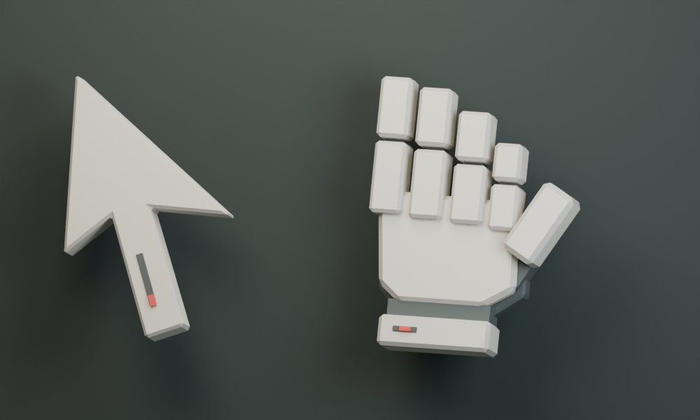
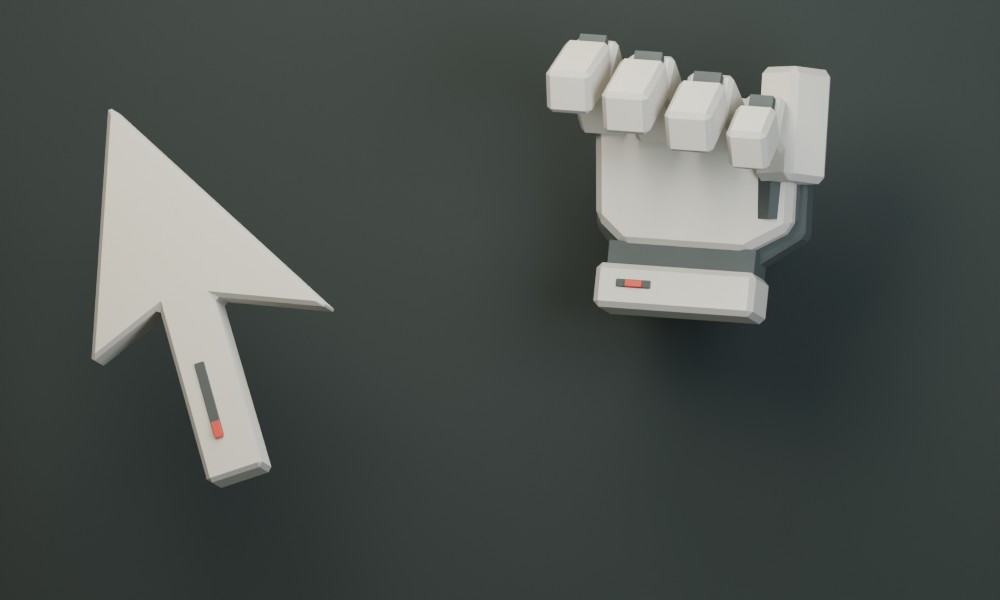
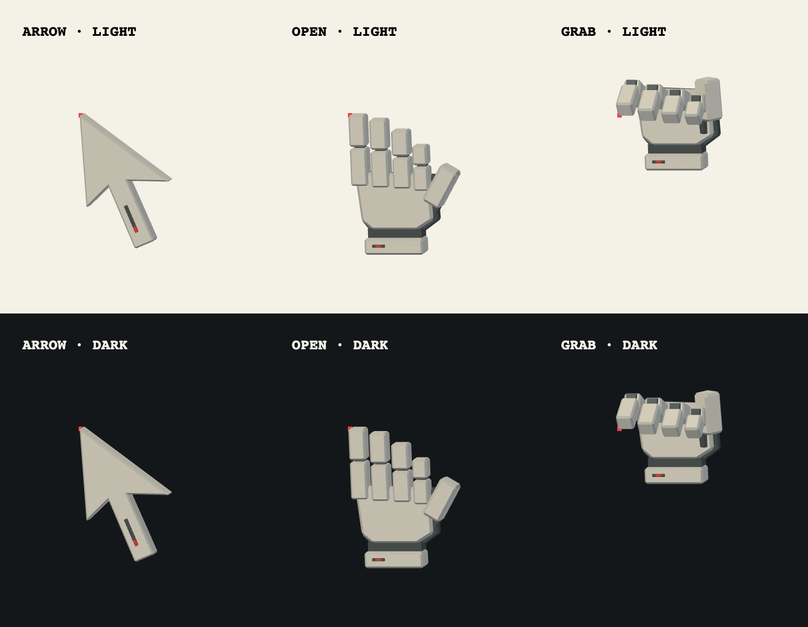

# Brutalist cursor models

Original, purpose-built geometry authored in Blender: a cast-concrete arrow and
an articulated architectural hand. Single-segment chamfers, recessed graphite
joints, and small oxide-red datum insets make the material and construction
legible at cursor size. No textures, external models, or generated image assets
are used.





The previews are Blender renders of the actual exported geometry. Website
lighting is supplied by its WebGPU renderer.

## Source and rebuilding

- `scripts/build-cursor-models.py` is the reproducible Blender modeling source.
- `cursors.blend` is the editable scene with materials, meshes, the `Grip` shape
  key, and an orthographic presentation camera. The scene is saved in open pose.
- `website/assets/cursors/v1/pointer.glb` and `hand.glb` are the browser assets.

Run from the repository root with Blender 5.x:

```sh
/Applications/Blender.app/Contents/MacOS/Blender --background --factory-startup \
  --python scripts/build-cursor-models.py
```

On other platforms, use the equivalent Blender executable. Its bundled Python
is sufficient; no add-ons, pip dependencies, or downloaded resources are needed.
Rebuilding regenerates both GLBs, the `.blend`, and the preview JPEGs. Make
persistent model changes in the script before rebuilding.

## Runtime contract

Both assets use core glTF 2.0: one mesh, four material primitives, indexed
triangles, float `POSITION` and `NORMAL` attributes, and PBR base-color factors.
There are no textures, required extensions, cameras, lights, skins, or animation
clips. Object transforms are baked; exported nodes have identity transforms.

Coordinates are **+X right, +Y up, +Z toward the viewer**. Export explicitly
retains these axes instead of applying Blender's default Z-up conversion.
The pointer tip and the hand's index fingertip each contain an actual vertex at
`(0, 0, 0)`. This is the browser pointer hotspot.

`hand.glb` has a single `Grip` morph target with dense position and normal deltas
on every primitive, default weight `0`. Interpolate to `1` for the curled pose.
The same fingertip vertex remains at the origin throughout the interpolation;
recessed joints and two concrete finger segments curl together. The grip can
extend above the origin and behind the open hand, so the renderer should keep
sufficient top padding and depth range.

| Asset / pose | Minimum XYZ | Maximum XYZ |
| --- | --- | --- |
| Pointer | `-0.021, -2.314, -0.273` | `1.502, 0, 0.049` |
| Open hand | `-0.033, -2.427, -0.419` | `1.858, 0, 0.089` |
| Gripping hand | `-0.033, -1.111, -1.353` | `1.552, 0.545, 0.113` |

The pointer is 168 triangles / 13,216 bytes. The hand is 736 triangles /
85,728 bytes including its morph. Combined transfer size before HTTP compression
is 98,944 bytes. Export-time checks validate the supported glTF subset, triangle
indices, material primitives, morph attributes, and identity node transforms.



## Website behavior

`homepage.rs` supplies content-hashed model URLs on both `/` and `/feed`.
`cursor-renderer.js` is a dependency-free WebGPU renderer for this specific glTF
subset. `big-cursor.js` owns input, damped orientation/click springs, grip
interpolation, and navigation cleanup. Position follows the mouse exactly;
only the model's orientation and press response have inertia.

The canvas is 192 CSS pixels with capped 2× resolution and 4× MSAA. Its hotspot
is `(48, 54)` with 52 pixels per model unit, allowing room for the curled hand
above the contact point. It renders only while input or a spring is changing.
A pointer-transparent manual popover keeps it above modal UI. The journey
router excludes that decorative popover when checking for open overlays.

Models load on the first mouse interaction. Native cursors stay in use for
unsupported WebGPU, reduced motion, coarse pointers, forced colors, save-data,
editable fields, and any model/GPU failure. Native cursor hiding starts only
after a successful frame. Leaving the feed disposes the GPU and aborts loading;
returning mounts a single fresh instance using the new page's asset URLs.

## Verification

Run `npm ci --prefix scripts --ignore-scripts` and `npm test --prefix scripts`.
The cursor suites exercise the real exported GLBs and renderer cleanup with a
GPU stub, plus controller input, fallback, popover, spring, and navigation
behavior. The Rust route test checks both pages' hashed model URLs, script
order, and binary asset responses.

Real Chrome WebGPU was also checked with the actual models in arrow/open/grip
states on light/dark backgrounds and on `/` and `/feed`, including a topic-chip
drag, bio/search overlays, native input cursors, reduced-motion changes, and
navigation to the store and back. The source previews above are Blender
renders; the browser uses the renderer's own lighting.

Validation on 2026-09-25: all 180 JavaScript tests pass; Rust unit/route tests,
formatting, and Clippy pass. The broad Rust browser run exposes an existing
`journey_navigation_respects_reduced_motion` failure at `/coach` ("long role
label does not shift the mobile slider"). The same assertion fails on pristine
base commit `bde0c0166` with the identical Cargo.lock; it is unrelated to this
cursor change.
