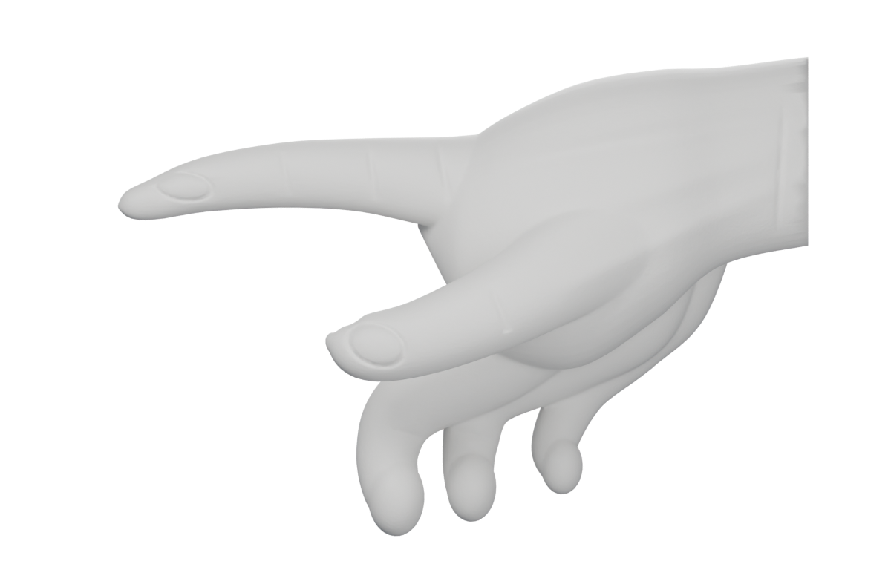
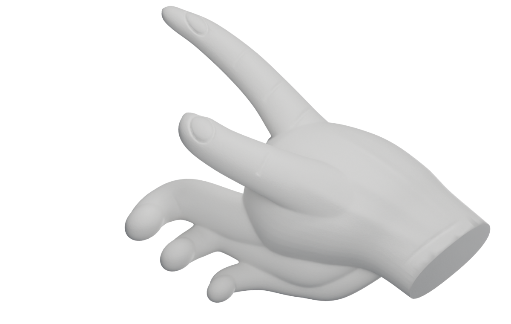
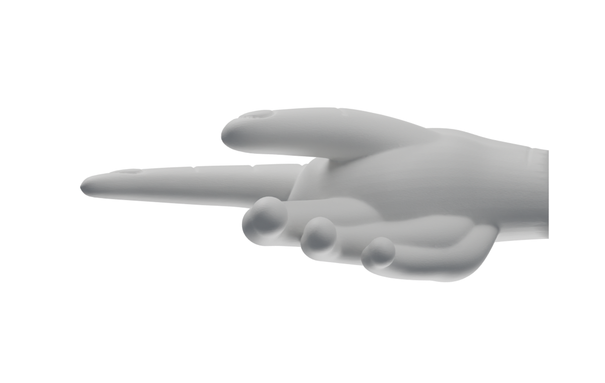

# Creation of Adam marble cursor

The link and drag cursor is an original Blender sculpture of God's right hand
from Michelangelo's *The Creation of Adam*: index reaching left, thumb crossing
below it, three relaxed curled fingers, and a closed cut at the wrist. The
orientation and cropped width/height follow the hand on the painting's right.
No forearm, robotic finger blocks, cuff, or reused 3D geometry is included.







These are Blender renders of the actual compact mesh. The browser independently
renders its exported GLB with back-face culling, procedural fine marble grain,
quiet veins, baked finger cavities, soft white lighting, and 4× MSAA. Its native
Chrome review includes front, true side, three-quarter and Grip views on light
and dark surfaces, plus the cursor on both `/` and `/feed`.

## Editable anatomy and reproducible export

`creation-hand.blend` preserves the detailed unified source (152,635 vertices)
in its own hidden collection. The browser copy is independently simplified to
12,975 vertices / 25,946 triangles. Both meshes are one connected outward-facing
closed solid with zero boundary or non-manifold edges. The wrist is bisected
and capped; fingernails and folds are carved surface relief, with no detached
nail shells. Each source and export has its own marble material.

`scripts/rebuild-marble-cursor.py` is the reproducible modeling source. Anatomy
lofts and rounded pads are fused into a continuous sculpted surface, then honed,
carved and cropped. The detailed source remains intact when the export is
simplified. Run from the repository root with Blender 5.1+:

```sh
/Applications/Blender.app/Contents/MacOS/Blender --background --factory-startup \
  --python-exit-code 1 --python scripts/rebuild-marble-cursor.py \
  -- --preview-dir /tmp/engmanager-marble-hand-review/blender
```

Use `--study-only` to render and inspect anatomy without packaging the GLB.
`creation-hand-validation.json` records source/export topology, the exact GLB
SHA-256, cavity range and export size (887,940 bytes before HTTP compression).
Source and review images are authoring assets and are not shipped to readers.
The older `cursors.blend`, architectural previews and
`scripts/build-cursor-models.py` retain the original pointer's authoring source;
the legacy builder would overwrite the current hand and is not the current
hand's rebuild command.

## Reference credits

The preserved JPEGs in `references/` are visual references; none is a texture,
mesh source, or shipped browser asset.

- **Pose:** Michelangelo, *The Creation of Adam*, circa 1511, Sistine Chapel.
  [Wikimedia Commons hand crop](https://commons.wikimedia.org/wiki/File:Michelangelo_-_Creation_of_Adam_(hand_crop).jpg),
  cropped by Joe bitten from the credited public-domain painting reproduction.
  Commons records Public Domain Mark 1.0 / PD-Art. We studied God's hand on the
  right, cropped at the wrist, and rebuilt its silhouette as original 3D anatomy.
- **Palm and pointing anatomy:** Than Ball (Than217), own photograph, 2006.
  [Index finger 2](https://commons.wikimedia.org/wiki/File:Index_finger_2.JPG).
  The author released it into the public domain. Used to compare finger joints,
  thumb mass and palm depth; the painting determines the pose.
- **Dorsal anatomy:** Coolgirly88, own photograph, 2007, cropped by Amada44.
  [Hand — Index finger](https://commons.wikimedia.org/wiki/File:Hand_-_Index_finger.jpg).
  The author released it into the public domain. Used to compare knuckles,
  extensor tendons, fingernails and the transition into a narrow wrist.

All sculpture geometry and relief are newly authored for engmanager.xyz.
The high-key honed ivory treatment follows the site's existing marble series.

## Cursor contract and behavior

The core glTF 2.0 asset has indexed triangles, baked identity transforms,
`POSITION`, `NORMAL`, normalized `COLOR_0`, one ivory PBR material and a single
`Grip` morph with dense position/normal deltas. There are no textures, skins,
required extensions, cameras, lights or animation clips.

Coordinates remain +X right, +Y up, +Z toward the viewer. A real left index-tip
vertex is exactly `(0, 0, 0)` in both poses. The Grip gently closes the three
curled fingers in depth while preserving the iconic pointing silhouette and
fingertip contact. Movement and click springs rotate around that same tip.
The 192 CSS pixel canvas uses `(36, 54)` as its hotspot, 52 pixels per model unit,
a capped 2× resolution and cached multisample/depth views. The original arrow
continues to indicate noninteractive surfaces.

Models load only for mouse intent on the homepage/feed. One same-origin worker
runs strict bounded GLB validation, with cancellation, an 8 second deadline and
10 second idle shutdown. Denied or unavailable workers use the same validation
cooperatively. The production CSP admits the exact content-hashed renderer as
its own worker entry point. GPU resources are fresh per mount and disposed on
navigation. The pointer-transparent manual popover stays above bio/search UI.

Native cursors remain for reduced motion, coarse/touch input, forced colors,
Save-Data, unavailable GPU, editable fields and rendering/model failures. The
custom cursor stops drawing when its springs settle, when hidden/offscreen,
and behind the revealed journey curtain. Leaving the feed releases its GPU;
retained feed/homepage remounts own exactly one fresh overlay.

## Verification

```sh
node --test scripts/cursor.test.mjs scripts/cursor-renderer.test.mjs
node scripts/inspect-marble-cursor.mjs --url=http://127.0.0.1:3097 \
  --output=/tmp/engmanager-marble-hand-review/native
node scripts/inspect-marble-cursor.mjs --url=http://127.0.0.1:3097 \
  --exposure=only --output=/tmp/engmanager-marble-hand-review/native-exposure
```

The portable tests decode the actual Blender GLB in both worker/cooperative
paths, verify material cavities, outward indexed volume, painting proportions,
asset provenance, tip anchoring and cancellation/disposal. Native Chrome checks
the real WGSL, visible uncropped triangles on both palettes, true profile,
fingertip coordinates, actual bio clicks, real drag/Grip, settled rendering,
retained navigation and reduced/Save-Data/GPU/worker fallbacks.
The separate exposure case uses a native wheel to enter the automatic reveal,
checks real Continue hit testing and zero cursor submissions, then scrolls back
and verifies that the cursor resumes. Neither case calls `prepareNext`.

Full required CI checks pass: 392 Node tests, immutable personality releases,
formatting, Clippy, and the complete required Rust/Chrome suite. Native WebGPU
reports and screenshots are preserved in the review directory. The candidate
release and matching CSS manifest are frozen for the latest/long-article journey
comparison; its AC-powered timing capture is pending the laptop power setup
required by `scripts/JOURNEY_PERFORMANCE.md`. See `_docs/cyclic-navigation-plan.md`.
