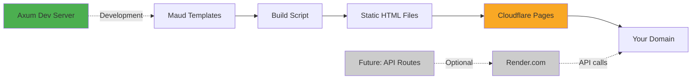

# Build Pre-Rendered Static Sites with Rust, Maud & Cloudflare Pages

This tutorial shows you how to build a static site generator using Rust and Maud templates, with an Axum dev server for local development, deployed to Cloudflare Pages for free. The architecture is designed to easily add an API layer on Render.com later when needed.

## Architecture Overview



**Current Stack:**
- **Development:** Axum dev server with live reload
- **Build:** Static HTML generation from Maud templates
- **Hosting:** Cloudflare Pages (free, unlimited bandwidth)
- **Cost:** $0

**Future (Optional):**
- **API:** Render.com for dynamic endpoints
- **Architecture:** Static pages on CF Pages + API on Render

---

## Prerequisites

- Rust installed (1.75.0 or newer)
- Git installed and configured
- A Cloudflare account (free tier works)
- Node.js & npm (for Wrangler CLI)
- A domain name (optional)

---

## Step One: Create the Workspace Structure

Create a workspace with two crates: one for the website, one for the build tool.

```bash
mkdir my-site
cd my-site
git init
```

Create the root `Cargo.toml`:

```toml
[workspace]
members = [
    "website",
    "builder",
]
resolver = "3"

[workspace.dependencies]
serde = { version = "1", features = ["derive"] }
anyhow = "1"
```

**Key Points:**
- `website` - Shared page logic, templates, and dev server
- `builder` - CLI tool to generate static HTML files
- `resolver = "3"` - Required for Rust edition 2024

**Confirmation:** Run `cargo --version`. Should show "cargo 1.75.0" or newer.

---

## Step Two: Create the Website Library

The website crate contains all your page templates and shared logic.

```bash
mkdir -p website/src/pages
mkdir -p website/assets
```

Create `website/Cargo.toml`:

```toml
[package]
name = "website"
version = "0.1.0"
edition = "2024"

[lib]
name = "website"
path = "src/lib.rs"

# Optional: Dev server binary
[[bin]]
name = "dev"
path = "src/main.rs"

[dependencies]
maud = "0.27.0"

# Optional: For dev server only
axum = { version = "0.8.7", optional = true }
tokio = { version = "1.48.0", features = ["full"], optional = true }
tower-http = { version = "0.6", features = ["fs"], optional = true }

[features]
dev-server = ["axum", "tokio", "tower-http"]
```

**Key Design:**
- Core library has zero runtime dependencies (just Maud)
- Dev server is optional (enabled with `dev-server` feature)
- Pages compile to static HTML at build time

---

## Step Three: Build the Page System

Create `website/src/lib.rs`:

```rust
use maud::{html, Markup, DOCTYPE};

// Trait that all pages must implement
pub trait Page {
    fn path() -> &'static str;
    fn title() -> &'static str;
    fn render() -> Markup;
}

// Shared layout wrapper
pub fn layout(title: &str, content: Markup) -> Markup {
    html! {
        (DOCTYPE)
        html lang="en" {
            head {
                meta charset="utf-8";
                meta name="viewport" content="width=device-width, initial-scale=1";
                title { (title) }
                link rel="stylesheet" href="/assets/styles.css";
            }
            body {
                nav class="nav" {
                    a href="/" { "Home" }
                    " | "
                    a href="/about" { "About" }
                    " | "
                    a href="/blog" { "Blog" }
                }
                main class="container" {
                    (content)
                }
            }
        }
    }
}

// Export pages module
pub mod pages;

// List all pages for the builder
pub fn all_pages() -> Vec<(&'static str, String)> {
    vec![
        (pages::index::IndexPage::path(), pages::index::IndexPage::render().into_string()),
        (pages::about::AboutPage::path(), pages::about::AboutPage::render().into_string()),
        (pages::blog::BlogPage::path(), pages::blog::BlogPage::render().into_string()),
    ]
}
```

**Confirmation:** Run `cargo check`. Should show error about missing `pages` module (expected).

---

## Step Four: Create Your Pages

Create the homepage at `website/src/pages/index.rs`:

```rust
use crate::{layout, Page};
use maud::{html, Markup};

pub struct IndexPage;

impl Page for IndexPage {
    fn path() -> &'static str {
        "/"
    }

    fn title() -> &'static str {
        "Home"
    }

    fn render() -> Markup {
        layout(Self::title(), html! {
            h1 { "Welcome Home" }
            p { "This is a static site built with Rust and Maud!" }

            section {
                h2 { "How It Works" }
                p {
                    "Pages are written in Rust using Maud templates. "
                    "At build time, they're compiled to static HTML. "
                }
            }

            section {
                h2 { "Benefits" }
                ul {
                    li { "⚡ Blazing fast - served from Cloudflare's edge" }
                    li { "💰 Free hosting with unlimited bandwidth" }
                    li { "🔒 Secure - no server to hack" }
                    li { "🦀 Type-safe templates at compile time" }
                }
            }
        })
    }
}
```

Create `website/src/pages/about.rs`:

```rust
use crate::{layout, Page};
use maud::{html, Markup};

pub struct AboutPage;

impl Page for AboutPage {
    fn path() -> &'static str {
        "/about"
    }

    fn title() -> &'static str {
        "About"
    }

    fn render() -> Markup {
        layout(Self::title(), html! {
            h1 { "About This Site" }

            article {
                h2 { "Technology Stack" }
                ul {
                    li { strong { "Rust" } " - Systems programming language" }
                    li { strong { "Maud" } " - Compile-time HTML templates" }
                    li { strong { "Cloudflare Pages" } " - Free static hosting" }
                }
            }

            article {
                h2 { "Why Static?" }
                p {
                    "Static sites are fast, secure, and free to host. "
                    "Perfect for blogs, documentation, and marketing sites."
                }
            }
        })
    }
}
```

Create `website/src/pages/blog.rs`:

```rust
use crate::{layout, Page};
use maud::{html, Markup};

pub struct BlogPage;

impl Page for BlogPage {
    fn path() -> &'static str {
        "/blog"
    }

    fn title() -> &'static str {
        "Blog"
    }

    fn render() -> Markup {
        layout(Self::title(), html! {
            h1 { "Blog" }

            article {
                h3 { "Coming Soon" }
                p { "Blog posts will appear here." }
            }
        })
    }
}
```

Create the pages module at `website/src/pages/mod.rs`:

```rust
pub mod index;
pub mod about;
pub mod blog;
```

Create basic CSS at `website/assets/styles.css`:

```css
* {
    margin: 0;
    padding: 0;
    box-sizing: border-box;
}

body {
    font-family: -apple-system, BlinkMacSystemFont, "Segoe UI", Roboto, sans-serif;
    line-height: 1.6;
    color: #333;
    max-width: 900px;
    margin: 0 auto;
    padding: 2rem;
}

.nav {
    padding: 1rem 0;
    margin-bottom: 2rem;
    border-bottom: 2px solid #eee;
}

.nav a {
    color: #0066cc;
    text-decoration: none;
    font-weight: 500;
    margin-right: 1rem;
}

.nav a:hover {
    text-decoration: underline;
}

.container {
    margin: 2rem 0;
}

h1 {
    color: #2c3e50;
    font-size: 2.5rem;
    margin-bottom: 1rem;
}

h2 {
    margin-top: 2rem;
    margin-bottom: 1rem;
    color: #34495e;
}

h3 {
    margin-top: 1.5rem;
    margin-bottom: 0.75rem;
}

p {
    margin-bottom: 1rem;
}

ul {
    margin-left: 1.5rem;
    margin-bottom: 1rem;
}

li {
    margin-bottom: 0.5rem;
}

section, article {
    margin: 2rem 0;
}
```

**Confirmation:** Run `cargo check`. Should compile successfully.

---

## Step Five: Create the Builder CLI

The builder generates static HTML files from your pages.

```bash
mkdir -p builder/src
```

Create `builder/Cargo.toml`:

```toml
[package]
name = "builder"
version = "0.1.0"
edition = "2024"

[[bin]]
name = "build"
path = "src/main.rs"

[dependencies]
website = { path = "../website" }
anyhow = { workspace = true }
```

Create `builder/src/main.rs`:

```rust
use anyhow::Result;
use std::fs;
use std::path::Path;

fn main() -> Result<()> {
    println!("🔨 Building static site...");

    // Clean and create dist directory
    let dist = Path::new("dist");
    if dist.exists() {
        fs::remove_dir_all(dist)?;
    }
    fs::create_dir_all(dist)?;

    // Get all pages from the website library
    let pages = website::all_pages();
    println!("📄 Generating {} pages...", pages.len());

    // Write each page to disk
    for (path, html) in pages {
        let file_path = if path == "/" {
            dist.join("index.html")
        } else {
            let page_dir = dist.join(path.trim_start_matches('/'));
            fs::create_dir_all(&page_dir)?;
            page_dir.join("index.html")
        };

        fs::write(&file_path, html)?;
        println!("  ✓ {} → {}", path, file_path.display());
    }

    // Copy static assets
    copy_dir_all("website/assets", dist.join("assets"))?;
    println!("  ✓ Copied assets/");

    println!("✅ Build complete! Output in dist/");
    Ok(())
}

fn copy_dir_all(src: impl AsRef<Path>, dst: impl AsRef<Path>) -> Result<()> {
    fs::create_dir_all(&dst)?;
    for entry in fs::read_dir(src)? {
        let entry = entry?;
        let ty = entry.file_type()?;
        if ty.is_dir() {
            copy_dir_all(entry.path(), dst.as_ref().join(entry.file_name()))?;
        } else {
            fs::copy(entry.path(), dst.as_ref().join(entry.file_name()))?;
        }
    }
    Ok(())
}
```

**Confirmation:** Build your static site:

```bash
cargo run --bin build
```

Expected output:
```
🔨 Building static site...
📄 Generating 3 pages...
  ✓ / → dist/index.html
  ✓ /about → dist/about/index.html
  ✓ /blog → dist/blog/index.html
  ✓ Copied assets/
✅ Build complete! Output in dist/
```

Verify the `dist/` folder structure:
```
dist/
├── index.html
├── about/
│   └── index.html
├── blog/
│   └── index.html
└── assets/
    └── styles.css
```

Open `dist/index.html` in your browser - should be fully rendered!

---

## Step Six: Optional Dev Server

For a better development experience, create a live-reload dev server.

Create `website/src/main.rs`:

```rust
#[cfg(feature = "dev-server")]
use axum::{response::Html, routing::get, Router};
#[cfg(feature = "dev-server")]
use tower_http::services::ServeDir;

#[cfg(feature = "dev-server")]
#[tokio::main]
async fn main() {
    use website::pages::*;

    let app = Router::new()
        .route("/", get(|| async {
            Html(index::IndexPage::render().into_string())
        }))
        .route("/about", get(|| async {
            Html(about::AboutPage::render().into_string())
        }))
        .route("/blog", get(|| async {
            Html(blog::BlogPage::render().into_string())
        }))
        .nest_service("/assets", ServeDir::new("website/assets"));

    println!("🚀 Dev server running on http://127.0.0.1:3000");
    println!("✨ Press Ctrl+C to stop");

    let listener = tokio::net::TcpListener::bind("127.0.0.1:3000")
        .await
        .unwrap();

    axum::serve(listener, app).await.unwrap();
}

#[cfg(not(feature = "dev-server"))]
fn main() {
    println!("Dev server requires the 'dev-server' feature");
    println!("Run: cargo run --bin dev --features dev-server");
}
```

**Usage:**

```bash
# Run dev server
cargo run --bin dev --features dev-server

# In another terminal, build static files
cargo run --bin build
```

Visit `http://127.0.0.1:3000` - should see your site with live reloading!

---

## Step Seven: Deploy to Cloudflare Pages

### 7.1: Install Wrangler

```bash
npm install -g wrangler
wrangler login
```

**Confirmation:** Run `wrangler --version`. Should show "wrangler 3.x.x".

### 7.2: Create Cloudflare Pages Project

1. Go to [dash.cloudflare.com](https://dash.cloudflare.com)
2. Navigate to **Workers & Pages**
3. Click **Create application** → **Pages** → **Upload assets**
4. Name it: `my-site`
5. Don't upload yet - we'll use CLI

### 7.3: Deploy via Wrangler

Build and deploy:

```bash
# Build static files
cargo run --bin build

# Deploy to Cloudflare Pages
wrangler pages deploy dist --project-name my-site
```

**Confirmation:** You should see:
```
✨ Success! Uploaded 4 files (3 already uploaded)
✨ Deployment complete! Take a peek over at https://my-site.pages.dev
```

Visit your site - it's live!

### 7.4: Set Up Custom Domain (Optional)

1. In Cloudflare dashboard, go to your Pages project
2. **Custom domains** → **Set up a custom domain**
3. Enter: `yourdomain.com`
4. Cloudflare auto-configures DNS

**Confirmation:** Visit `https://yourdomain.com` - should load your site!

---

## Step Eight: Automated Deployment

### Option A: GitHub Actions

Create `.github/workflows/deploy.yml`:

```yaml
name: Deploy to Cloudflare Pages

on:
  push:
    branches: [main]

jobs:
  deploy:
    runs-on: ubuntu-latest
    steps:
      - uses: actions/checkout@v4

      - name: Install Rust
        uses: dtolnay/rust-toolchain@stable

      - name: Build static site
        run: cargo run --bin build

      - name: Deploy to Cloudflare Pages
        uses: cloudflare/wrangler-action@v3
        with:
          apiToken: ${{ secrets.CLOUDFLARE_API_TOKEN }}
          accountId: ${{ secrets.CLOUDFLARE_ACCOUNT_ID }}
          command: pages deploy dist --project-name=my-site
```

**Setup:**
1. Get Cloudflare API token: Dashboard → My Profile → API Tokens
2. Add secrets to GitHub: Settings → Secrets → Actions
   - `CLOUDFLARE_API_TOKEN`
   - `CLOUDFLARE_ACCOUNT_ID`

**Confirmation:** Push to GitHub - site auto-deploys on every commit!

### Option B: Manual Script

Create `deploy.sh`:

```bash
#!/bin/bash
set -e

echo "🔨 Building static site..."
cargo run --bin build

echo "🚀 Deploying to Cloudflare Pages..."
wrangler pages deploy dist --project-name my-site

echo "✅ Deployment complete!"
```

```bash
chmod +x deploy.sh
./deploy.sh
```

---

## Step Nine: Add a .gitignore

Create `.gitignore`:

```gitignore
/target
/dist
**/*.rs.bk
.env
.DS_Store
node_modules/
```

Commit everything:

```bash
git add .
git commit -m "Initial commit: Static site with Rust + Maud"
```

---

## Step Ten: Future API Integration

When you're ready to add dynamic features, here's how to add an API on Render.com:

### Architecture


### Example: Add API Workspace

```bash
mkdir -p api/src
```

`api/Cargo.toml`:
```toml
[package]
name = "api"
version = "0.1.0"
edition = "2024"

[dependencies]
axum = "0.8.7"
tokio = { version = "1.48.0", features = ["full"] }
serde = { workspace = true }
```

`api/src/main.rs`:
```rust
use axum::{Json, Router, routing::post};
use serde::{Deserialize, Serialize};

#[derive(Deserialize)]
struct ContactForm {
    name: String,
    email: String,
    message: String,
}

#[derive(Serialize)]
struct Response {
    success: bool,
}

async fn submit_contact(Json(form): Json<ContactForm>) -> Json<Response> {
    // Handle form submission
    println!("Contact from: {} <{}>", form.name, form.email);
    Json(Response { success: true })
}

#[tokio::main]
async fn main() {
    let app = Router::new()
        .route("/api/contact", post(submit_contact));

    let port = std::env::var("PORT")
        .unwrap_or_else(|_| "3000".to_string())
        .parse()
        .unwrap();

    let listener = tokio::net::TcpListener::bind(("0.0.0.0", port))
        .await
        .unwrap();

    axum::serve(listener, app).await.unwrap();
}
```

Deploy API to Render.com, then call from static pages:

```rust
// In your Maud template
script {
    r#"
    async function submitForm(event) {
        event.preventDefault();
        const response = await fetch('https://my-api.onrender.com/api/contact', {
            method: 'POST',
            headers: { 'Content-Type': 'application/json' },
            body: JSON.stringify({
                name: event.target.name.value,
                email: event.target.email.value,
                message: event.target.message.value
            })
        });
        const result = await response.json();
        alert(result.success ? 'Sent!' : 'Error');
    }
    "#
}
```

---

## Performance & Best Practices

### Build Optimization

Add to `Cargo.toml`:
```toml
[profile.release]
opt-level = "z"     # Optimize for size
lto = true          # Link-time optimization
codegen-units = 1   # Better optimization
strip = true        # Remove debug symbols
```

### Caching Strategy

Cloudflare Pages automatically:
- ✅ Caches all static assets at the edge
- ✅ Provides HTTP/2 and HTTP/3
- ✅ Compresses with Brotli/Gzip
- ✅ Serves from 300+ edge locations

### Adding More Pages

1. Create new page in `website/src/pages/`
2. Implement `Page` trait
3. Add to `all_pages()` in `lib.rs`
4. Rebuild: `cargo run --bin build`
5. Deploy: `wrangler pages deploy dist --project-name my-site`

---

## Troubleshooting

### Build fails
**Symptom:** "error: could not compile"

**Solution:**
```bash
cargo clean
cargo check
cargo run --bin build
```

### 404 on Cloudflare Pages
**Symptom:** Page not found

**Solutions:**
- Verify `dist/` has correct structure
- Check page paths in `all_pages()`
- Ensure subdirectories have `index.html`

### CSS not loading
**Symptom:** Unstyled pages

**Solutions:**
- Check `/assets/styles.css` path in layout
- Verify `copy_dir_all` copied assets
- Check browser console for 404s

---

## Cost Breakdown

| Service | Usage | Cost |
|---------|-------|------|
| Cloudflare Pages | Unlimited requests, 500 builds/month | **$0** |
| Custom domain | SSL, CDN, DDoS protection | **$0** |
| Build server | Local machine | **$0** |
| **Total** | | **$0/month** |

**Future with API:**
| Service | Usage | Cost |
|---------|-------|------|
| Render.com | 750 hours/month free tier | **$0** |
| Or paid tier | 24/7 uptime | **$7/month** |

---

## Summary

You've built:
- ✅ Static site generator with Rust + Maud
- ✅ Type-safe compile-time templates
- ✅ Optional Axum dev server
- ✅ Deployed to Cloudflare Pages (free)
- ✅ Custom domain with auto-SSL
- ✅ Global edge caching
- ✅ Ready for future API integration

**Total cost:** $0/month
**Build time:** Seconds
**Global latency:** <50ms

When you need dynamic features, add an API on Render.com and keep static pages on Cloudflare Pages for the best of both worlds! 🦀
